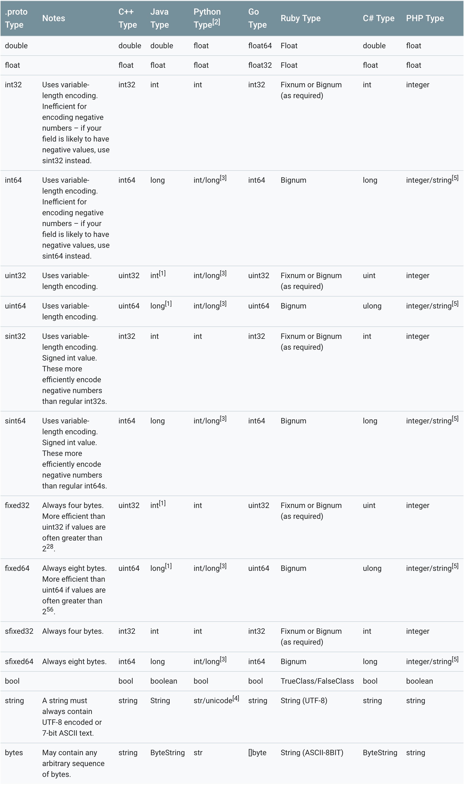

> 最近碰到一个关于`frameworks/base/core/proto/android/providers/settings/secure.proto`文件中修改某个属性的问题，所以针对protobuf(.proto文件)进行一个学习了解。  
> Google Protocol Buffers，（简称Protobuf，协议缓冲区），类似json或XML，Google开源的支持多语言、跨平台的结构化数据序列化项目，但是比它们更小、更快、更简单。  
> Protobuf通过编写proto文件来定义消息格式或RPC服务定义。

<!--more-->

# 1. proto模块介绍

在Framework模块中有个单独的模块：`frameworks/base/core/proto/`

查看该模块下的README.md和OWNDER文件有简单介绍。OWNER劝告开发人员需要熟悉该功能，谨慎修改。

## 1.1. README.md文件内容

1. Android其他版本中，使用四个空格缩进，而非两个
2. 基于Java文件的protos文件，使用该Java文件相同名称的包。例如`com.android.server.thing`代替`com.android.server.thing.proto`
3. 如果proto描述了dumpsys的顶级输出，他就应该包含dump。这样更容易理解他是作为某个服务的dump输出，而不是该服务的数据结构。例如`WindowManagerServiceDumpProto`和`WindowManagerServiceProto`
+ 含有poroto后缀的message名称，他的内嵌的message的名称不需要有proto后缀，例如：

```java
message FooProto {
    message Bar {
        ...
    }
}

&&

message FooProto {
    message BarProto {  //没必要有proto后缀
        ...
    }
}
```

如果proto代表一个对象的结构，后缀应该要有`proto`。并且还请包含该原是对象的完整包路径，来作为对这个proto message的注释。

1. 在字段中包含单位名字，例如：`screen_time_ms` VS `screen_time`, or `file_size_bytes` or `file_size_mebibytes` VS `file_size`

2. 保留字段号50000-100000，供原始设备制造商使用。

***

# 2. 编写proto文件

## 2.1. 范例helloworld.proto

> 代码在https://github.com/grpc/grpc/blob/master/examples/protos/helloworld.proto

```s
//helloworld.proto
//版本号，默认版本是2
syntax = "proto3";
 
option java_multiple_files = true;
option java_package = "io.grpc.examples.helloworld";
option java_outer_classname = "HelloWorldProto";
option objc_class_prefix = "HLW";
 
package helloworld;
 
// The greeting service definition.
service Greeter {
  // Sends a greeting
  rpc SayHello (HelloRequest) returns (HelloReply) {}
}
 
// The request message containing the user's name.
// 一个message类型看上去像是Java class，由多个字段组成
//每一个字段都由类型、名称组成，位于等号右边的值不是字段默认值，而是字段编号，可以理解为字段身份的标识符，类似于数据库中的主键，不可重复
//标识符用于在编译后的二进制消息格式中对字段进行识别，一旦投入使用，字段的标识就不应该再改变。
//数字标签的范围是[1, 536870911]，其中19000～19999是保留数字。
message HelloRequest {
  string name = 1;
}

// The response message containing the greetings
message HelloReply {
  string message = 1;
}

message SearchRequest {
  required string query = 1; 
  required int32 page_number = 2;
  optional int32 result_per_page = 3;
}
```

## 2.2. protobuf和其他编程语言的类型比较



## 2.3. 字段编号

字段编号是Protobuf的重要组成部分。它们用于标识二进制编码数据中的字段，这意味着它们不能从版本更改为服务版本。优点在于可以实现向后兼容性和向前兼容性。只要处理丢失值的可能性，客户端和服务就会忽略他们不知道的字段编号。

在二进制格式中，字段号与类型标识符组合在一起。1到15之间的字段编号可以使用其类型编码为单字节。从16到2047的数字需要2个字节。如果出于任何原因需要将超过2047个字段，则可以更高。字段号1到15的单字节标识符提供更好的性能，因此，你应将其用于最基本的常用字段。

## 2.4. 限定符说明

限定符|说明
:-:|:-:
required|必须字段，必须设置该字段的值
optional|可选字段，有选择性的设置或者不设置该字段的值
repeated|表示该字段可以被重复任意多次包含

## 2.5. 包package

可以用指定package以避免类型命名冲突：

```s
package foo.bar;
message Open { ... }
```

也可以用类型的全限定名来引用它：

```s
message Foo {
  ...
  foo.bar.Open open = 1;
  ...
}
```

**Note:**指定包名后，会对生成的代码产生影响，以Java为例，生成的类会以你指定的package作为包名。

## 2.6. 修改规则

如果修改正在使用的proto文件，比如为类型增加一个字段，protobuf支持这种修改而不影响已有的服务，不过需要遵循一定的规则：

1. 不改变已有字段的字段编号 
2. 当增加一个新的字段的时候，老系统序列化后的数据依然可以被新的格式所解析，只不过需要处理新加字段的缺省值。 
3. 字段也可以被移除，但是建议`Reserved`这个字段，避免将来会使用这个字段 
4. int32, uint32, int64, uint64 和 bool类型都是兼容的 
5. sint32 和 sint64兼容，但是不和其它整数类型兼容 
6. string 和 bytes兼容，如果 bytes 是合法的UTF-8 bytes的话 
7. 嵌入类型和bytes兼容，如果bytes包含一个消息的编码版本的话 
8. fixed32和sfixed32, fixed64和sfixed64 enum和int32, uint32, int64, uint64格式兼容

## 2.7. 嵌套类型

通过协议缓冲区（Protobuf）可以在其他消息中嵌套消息定义。 下面的示例演示如何创建嵌套消息类型：

```s
message Outer {
    message Inner {
        string text = 1;
    }
    Inner inner = 1;
}
```

## 2.8. repeated修饰符

如果一个字段被repeated修饰，则表示它是一个列表类型的字段，如下所示：

```s
message SearchRequest {
  repeated string args = 1 // 等价于java中的List<string> args
}
```

如果希望可以预留一些数字标签或者字段可以使用reserved修饰符：

```s
message Foo {
  reserved 2, 15, 9 to 11;
  reserved "foo", "bar";
  // string foo = 3  //编译报错，因为‘foo’已经被标为保留字段
}
```

## 2.9. 保留字段reserved

Protobuf中的向后兼容性保证依赖于始终表示相同数据项的字段编号。如果从服务新版本中的消息中删除了字段，则不应重复使用该字段编号。

可以使用reserved关键字强制执行此情况。

如果定义Stock的消息中删除某字段，则应保留其字段编号，如以下示例所示。

```s
syntax "proto3";

message Stock {

    reserved 3, 4;
    int32 id = 1;
    string symbol = 2;

}
```

还可以将reserved关键字用作将来可能添加的字段的占位符。 您可以使用`to`关键字将连续字段数表示为范围。

```s
syntax "proto3";

message Info {

    reserved 2, 9 to 11, 15;
    // ...
}
```

## 2.10. Any和OneOf字段

Protobuf提供了两个用于处理可能属于多个类型的值的更简单选项。

Any类型可以表示任何已知的Protobuf消息类型。

使用oneof关键字来指定在任何消息中只能设置一个字段范围中的一个字段。

1. Any是Protobuf的"已知类型"：一系列有用的可重复使用的消息类型，具有所有支持语言的实现。若要使用Any类型，必须导入`google/protobuf/any.proto`定义

```s
syntax "proto3"

import "google/protobuf/any.proto"

message Stock {
    // Stock-specific data
}

message Currency {
    // Currency-specific data
}

message ChangeNotification {
    int32 id = 1;
    google.protobuf.Any instrument = 2;
}
```

2. Oneof是一项语言功能：编译器在生成message类时处理oneof关键字。使用oneof指定ChangeNotification消息可能如下所示：

在整个消息声明中，oneof集内的字段必须具有唯一的字段编号。

```s
message Stock {
    // Stock-specific data
}

message Currency {
    // Currency-specific data
}

message ChangeNotification {
  int32 id = 1;
  oneof instrument {
    Stock stock = 2;
    Currency currency = 3;
  }
}
```

**Note:**
+ 设置属于oneof集一部分的任何字段都将自动清除该集中的任何其他字段。不能将repeated与oneof一起使用。相反，可以创建包含重复字段或oneof集的嵌套消息，以解决此限制。
+ oneof块中的字段不支持repeated。

## 2.11. 枚举

上面使用枚举来确定Oneof字段的类型。可以定义自己的枚举类型，Protobuf将它们编译为C#（或者其他语言）枚举类型。

由于Protobuf可以用于各种语言，因此枚举的命名约定与C#约定不同。

但是，代码生成器将名称转换为传统的C#大小写。如果字段名称的Pascal大小写以枚举名称开头，则将其删除。

例如，在下面的Protobuf枚举中，字段用预缀为ACCOUNT_STATUS。

**第一个枚举值的数值必须是0且至少有一个枚举值，否则编译报错。编译后编译器会为你生成对应语言的枚举类。**

```s
enum AccountStatus {
  ACCOUNT_STATUS_UNKNOWN = 0;
  ACCOUNT_STATUS_PENDING = 1;
  ACCOUNT_STATUS_ACTIVE = 2;
  ACCOUNT_STATUS_SUSPENDED = 3;
  ACCOUNT_STATUS_CLOSED = 4;
}
```

由于编码原因，出于效率考虑，官方不推荐使用负数作为枚举值的数值。

## 2.12. 类型默认值

1. string类型的默认值是空字符串
2. bytes类型的默认值是空字节
3. bool类型的默认值是false
4. 数字类型的默认值是0
5. enum类型的默认值是第一个定义的枚举值
6. message类型的默认值与语言相关
7. repeated修饰的字段默认值是空列表

## 2.13. import public的传递引用功能

```s
//////////////
// 文件：new.proto
// 原来在old.proto文件中的定义移到这里

///////////////
// 文件：old.proto
import public "new.proto"; // 把引用传递给上层使用方
import "other.proto"; // 引用old.proto本身使用的定义

///////////////
// 文件：client.proto
import "old.proto";
// 此处可以引用old.proto和new.proto中的定义，但不能使用other.proto中的定义
```

从这个例子中可以看到`import`关键字导入的定义仅在当前文件有效，不能被上层使用方引用（client.proto无法使用other.proto中的定义）

而`import public`关键字导入的定义可以被上层使用方引用（client.proto可以使用new.proto中的定义），`import public`的功能可以看作是import的超集，在import的功能上还具有传递引用的作用。

## 2.14. option选项

选项不对message的定义产生任何的效果，只会在一些特定的场景中起到作用：

1. `option java_package = "com.example.foo";` 编译器为以此作为生成的Java类的包名，如果没有该选项，则会以pb的package作为包名。
2. `option java_multiple_files = true;` 该选项为true时，生成的Java类将是包级别的，否则会在一个包装类中。
3. `option optimize_for = CODE_SIZE;` 该选项会对生成的类产生影响，作用是根据指定的选项对代码进行不同方面的优化。
4. `int32 old_field = 6 [deprecated=true];` 把字段标为过时的。

***

# 3. protoBuf缺点

Protbuf相比XML来说，主要优点是性能高。也有不足之处，功能简单，无法用来表示复杂的概念。

由于文本并不适合用来描述数据结构，所以Protobuf也不适合用来对基于文本的标记文档（如HTML建模。另外，由于XML具有某种程度上的自解释性，它可以被人直接读取编辑，在这一点上Protobuf以二进制的方式存储，除非有`.proto`定义，否则无法直接读出Protobuf的任何内容。

# 4. 参考文献

+ [Google官方文档](https://developers.google.com/protocol-buffers/docs/overview)
+ [Protobuf Github项目文档地址](https://developers.google.com/protocol-buffers/docs/overview)
+ [Protobuf 保留字段](https://docs.microsoft.com/zh-cn/dotnet/architecture/grpc-for-wcf-developers/protobuf-reserved)
+ [在Golang中安装使用Protobuf](https://studygolang.com/articles/2540)
+ [Protobuf3学习笔记](https://www.jianshu.com/p/ea656dc9b037)