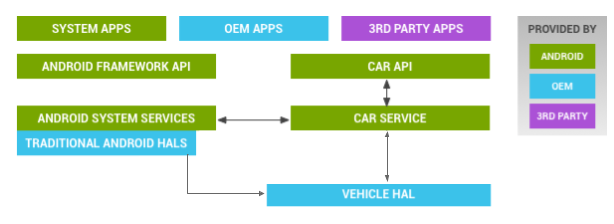
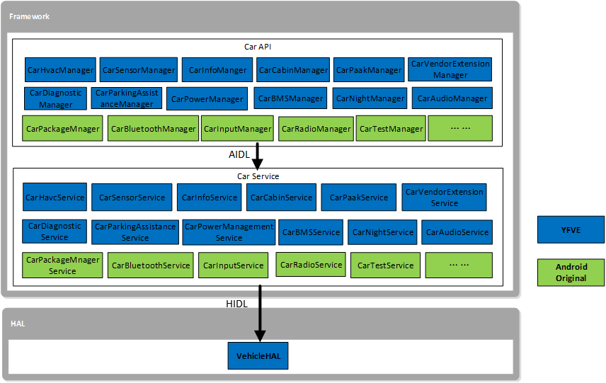
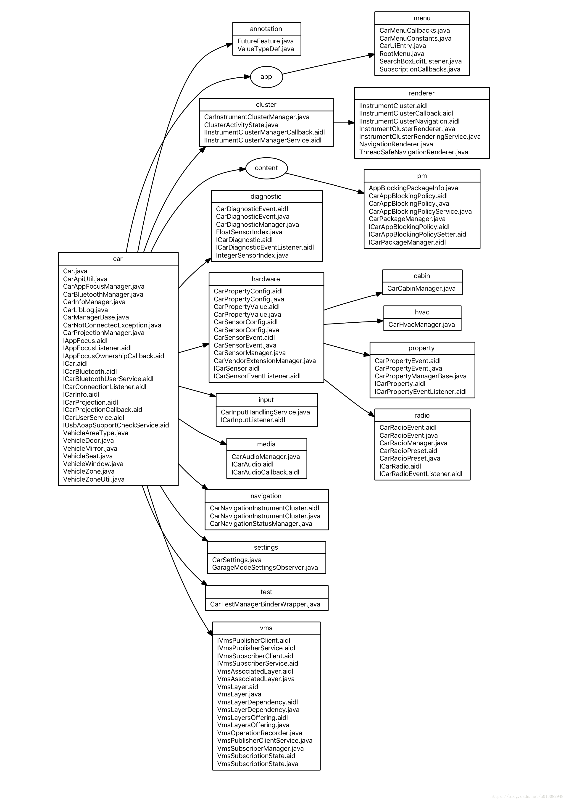
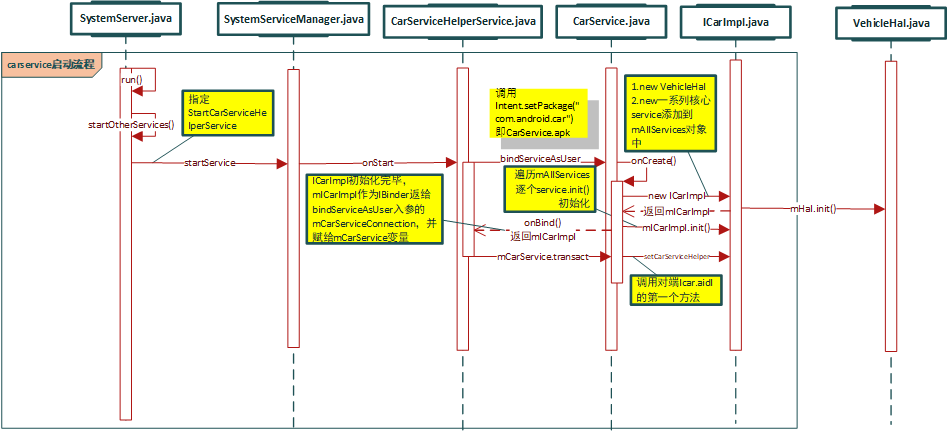

> 文档内容：carservice架构介绍，内容有Car APP、Car API、Car Service等部分，carservice启动流程

***

# 概述

## 架构

Google官网上介绍汽车架构：

车载HAL是汽车与车辆网络服务之间的接口定义（同时保护传入的数据）：



车载HAL与Android Automotive架构：

+ Car App：包括OEM和第三方开发的App
+ Car API：内有包含CarSensorManager在内的API。位于/platform/packages/services/Car/car-lib
+ CarService：系统中与车相关的服务，位于/platform/packages/services/Car/
+ Vehicle HAL：汽车的硬件抽象层描述。位于hardware/interfaces/automotive/vehicle/2.0/default/（接口属性：hardware/interfaces/automotive/vehicle/2.0/default/impl/vhal_v2_0/）

***

### Framework CarService

> Android O/P为Automotive场景提供了一系列的服务，这些服务统被称为CarService。它们与HAL层的VehicleHAL通信，进而通过车载总线(例如CAN总线)与车身进行通讯，同时它们还为应用层的APP提供接口，从而让APP能够实现对车身的控制与状态的显示



+ Car***Manager:`packages/services/Car/car-lib/src/android/car/hardware`  
+ Car***Service:`packages/services/Car/service/src/com/android/car/`

***

## APP层

### APP层确认是否支持车载功能

1. APP层在调用Car API之前首先会判断该平台是否支持车载功能：

```java
if (getPackageManager().hasSystemFeature(PackageManager.FEATURE_AUTOMOTIVE)) {
    .....
}
```

例如：

```java packages/apps/SettingsIntelligence/src/com/android/settings/intelligence/suggestions/eligibility/AutomotiveEligibilityChecker.java
    public static boolean isEligible(Context context, String id, ResolveInfo info) {
        PackageManager packageManager = context.getPackageManager();
        //是否支持车载功能
        boolean isAutomotive = packageManager.hasSystemFeature(PackageManager.FEATURE_AUTOMOTIVE);
        //是否有车载功能支持的资格
        boolean isAutomotiveEligible =
                info.activityInfo.metaData.getBoolean(META_DATA_AUTOMOTIVE_ELIGIBLE, false);
        if (isAutomotive) {
            if (!isAutomotiveEligible) {
                Log.i(TAG, "Suggestion is ineligible for FEATURE_AUTOMOTIVE: " + id);
            }
            return isAutomotiveEligible;
        }
        return true;
    }
```

```java frameworks/base/services/core/java/com/android/server/pm/PackageManagerService.java
    @GuardedBy("mAvailableFeatures")
    final ArrayMap<String, FeatureInfo> mAvailableFeatures;

    @Override
    public boolean hasSystemFeature(String name, int version) {
        // allow instant applications
        synchronized (mAvailableFeatures) {
            final FeatureInfo feat = mAvailableFeatures.get(name);
            if (feat == null) {
                return false;
            } else {
                return feat.version >= version;
            }
        }
    }
```

2. 通过Binder访问PackageManagerService，mAvailableFeatures里面的内容是通过读取/system/etc/permissions下面的xml文件(对应SDK的位置---frameworks/native/data/etc下的XML文件中的feature字段)

```xml frameworks/native/data/etc/car_core_hardware.xml
<permissions>
    <!-- Feature to specify if the device is a car -->
    <feature name="android.hardware.type.automotive" />
    .....
</permission>
```

```xml frameworks/native/data/etc/android.hardware.type.automotive.xml
<!-- These features determine that the device running android is a car. -->
<permissions>
    <feature name="android.hardware.type.automotive" />
</permissions>
```

***

### APP创建Car API，接收底层回调

> Car作为汽车平台最高等级的API（`packages/services/Car/car-lib/src/android/car/Car.java`），为外界提供汽车所有服务和数据的访问

1. 通过createCar方法可以新建一个Car实例
2. 通过connect方法连接CarService
3. 当成功连接时可以通过getCarManager方法获取一个一个相关的manager，比如Hvac通过getCarManager方法获取了一个CarHvacManager，当获取到manager后就可以进行相关操作

例如HvacController.java：

```java packages/apps/Car/Hvac/src/com/android/car/hvac/HvacController.java
  private Object mHvacManagerReady = new Object();

 @Override
    public void onCreate() {
        super.onCreate();
        if (getPackageManager().hasSystemFeature(PackageManager.FEATURE_AUTOMOTIVE)) {
            if (SystemProperties.getBoolean(DEMO_MODE_PROPERTY, false)) {
                IBinder binder = (new LocalHvacPropertyService()).getCarPropertyService();
                initHvacManager(new CarHvacManager(binder, this, new Handler()));
                return;
            }
            //创建Car实例，即new Car对象
            mCarApiClient = Car.createCar(this, mCarConnectionCallback);
            //connect连接，调用startCarService启动CarService
            mCarApiClient.connect();
        }
    }

    private final CarConnectionCallback mCarConnectionCallback =
            new CarConnectionCallback() {
                @Override
                public void onConnected(Car car) {
                    synchronized (mHvacManagerReady) {
                        try {
                            //getCarManager获取manager
                            //在获取到CarHvacManager后，可以直接调用CarHvacManager提供的接口
                            //例如mHvacManager.getPropertyList();
                            initHvacManager((CarHvacManager) mCarApiClient.getCarManager(
                                    android.car.Car.HVAC_SERVICE));
                            mHvacManagerReady.notifyAll();
                        } catch (CarNotConnectedException e) {
                            Log.e(TAG, "Car not connected in onServiceConnected");
                        }
                    }
                }

                @Override
                public void onDisconnected(Car car) {
                }
            };

    private void initHvacManager(CarHvacManager carHvacManager) {
        mHvacManager = carHvacManager;
        List<CarPropertyConfig> properties = null;
        try {
            properties = mHvacManager.getPropertyList();
            mPolicy = new HvacPolicy(HvacController.this, properties);
            //注册回调
            mHvacManager.registerCallback(mHardwareCallback);
        } catch (android.car.CarNotConnectedException e) {
            Log.e(TAG, "Car not connected in HVAC");
        }
    }

    @Override
    public void onDestroy() {
        super.onDestroy();
        if (mHvacManager != null) {
            //取消注册回调
            mHvacManager.unregisterCallback(mHardwareCallback);
        }
        if (mCarApiClient != null) {
            mCarApiClient.disconnect();
        }
    }

    //接收处理callback消息
    private final CarHvacManager.CarHvacEventCallback mHardwareCallback =
            new CarHvacManager.CarHvacEventCallback() {
                @Override
                public void onChangeEvent(final CarPropertyValue val) {
                    int areaId = val.getAreaId();
                    switch (val.getPropertyId()) {
                        case CarHvacManager.ID_ZONED_AC_ON:
                            handleAcStateUpdate(getValue(val));
                            break;
                        case CarHvacManager.ID_ZONED_FAN_DIRECTION:
                            handleFanPositionUpdate(areaId, getValue(val));
                        .....
                        default:
                            if (Log.isLoggable(TAG, Log.DEBUG)) {
                                Log.d(TAG, "Unhandled HVAC event, id: " + val.getPropertyId());
                            }
                    }
                }

                @Override
                public void onErrorEvent(final int propertyId, final int zone) {
                }
            };
```

例如Radio APP的RadioTunerExt.java文件：

```java packages/apps/Car/Radio/src/com/android/car/radio/platform/RadioTunerExt.java
    RadioTunerExt(Context context) {
        //创建Car实例，即new Car对象
        mCar = Car.createCar(context, mCarServiceConnection);
        //connect连接，调用startCarService启动CarService
        mCar.connect();
    }

    private final ServiceConnection mCarServiceConnection = new ServiceConnection() {
        @Override
        public void onServiceConnected(ComponentName name, IBinder service) {
            synchronized (mLock) {
                try {
                    //getCarManager获取manager
                    mCarAudioManager = (CarAudioManager)mCar.getCarManager(Car.AUDIO_SERVICE);
                    if (mPendingMuteOperation != null) {
                        boolean mute = mPendingMuteOperation;
                        mPendingMuteOperation = null;
                        Log.i(TAG, "Car connected, executing postponed operation: "
                                + (mute ? "mute" : "unmute"));
                        setMuted(mute);
                    }
        .....
```

***

# 目录结构

## CarService一级目录结构说明（`packages/services/Car/`）

> 目录：`packages/services/Car/`

```s
.
├── Android.mk
├── apicheck.mk
├── apicheck_msg_current.txt
├── apicheck_msg_last.txt
├── car-cluster-logging-renderer    //LoggingClusterRenderingService继承InstrumentClusterRenderingService
├── car-default-input-service   //按键消息处理
├── car-lib         //提供给汽车App特有的接口，许多定制的模块都在这里实现，包括Sensor,HVAC,Cabin,ActiveParkingAssiance,Diagnostic,Vendor等
├── car-maps-placeholder    //地图软件相关
├── car_product         //系统编译相关
├── car-support-lib     //android.support.car
├── car-systemtest-lib  //系统测试相关
├── car-usb-handler     //开机自启，用于管理车机USB
├── CleanSpec.mk
├── evs  
├── obd2-lib
├── PREUPLOAD.cfg
├── procfs-inspector
├── service    //com.android.car是一个后台运行的组件，可以长时间运行并且不需要和用户去交互的，这里即使应用被销毁，它也可以正常工作
├── tests
├── tools   //是一系列的工具，要提到的是里面的emulator，测试需要用到的。python写的，通过adb可以连接vehicleHal的工具，用于模拟测试
├── TrustAgent
└── vehicle-hal-support-lib
```

## Car APP

+ `packages/services/Car/car_product/build/car.mk`里面决定了是否编译相关apk（system/priv-app）
+ 
+ 源码位置：：`packages/apps/Car/`

这个文件中列出了汽车系统中的专有模块（首字母大写的模块基本上都是汽车系统中专有的App）：

```mk packages/services/Car/car_product/build/car.mk
# Automotive specific packages
PRODUCT_PACKAGES += \
    CarService \
    CarTrustAgentService \
    CarDialerApp \                      # 电话应用，包含拨号键盘、通话记录等
    CarRadioApp \                       # 收音机应用
    OverviewApp \
    CarLauncher \
    CarLensPickerApp \                  # 活动窗口选择应用（Launcher）
    LocalMediaPlayer \                  # 提供本地播放服务的应用
    CarMediaApp \                       # 媒体应用，包含播放界面等
    CarMessengerApp \                   # 消息管理应用，包含消息及TTS相关功能
    CarHvacApp \                        # 空调应用，空调显示及操作界面
    CarMapsPlaceholder \
    CarLatinIME \                       # 输入法应用
    CarSettings \                       # 设置应用
    CarUsbHandler \
    android.car \
    car-frameworks-service \
    com.android.car.procfsinspector \
    libcar-framework-service-jni \
....
PRODUCT_PACKAGES += \
    Bluetooth \
    OneTimeInitializer \
    Provision \
    SystemUI \
    SystemUpdater                       # 系统升级应用
```

## Car API

+ 源码位置：`/platform/packages/services/Car/car-lib`，因为对手机和平板没有意义，仅用于开发汽车，所以没有包含在Framework SDK中

Car API（详细路径：`packages/services/Car/car-lib/src/android/car/`）有如下：


**Car API类图：**



***

## Car Service

+ 源码位置：`packages/services/Car/`

**CarServcie模块与很多模块都需要交互(供参考)：**

+ 向上给APP提供API接口；
+ 向下与MCU进行通信，进而和车身网络进行交互；
+ 给其他模块提供标定项信息；
+ 给Camera模块提供Digital RVC控制信息等；
+ 可以获取DSP版本、前屏版本号等；
+ 持有Power模块的锁，carservice挂了就会息屏


***

## AIDL

> Android接口定义语言，一种android内部进程通信接口的描述语言，通过它我们可以定义进程间的通信接口

如要使用 AIDL 创建绑定服务，请执行以下步骤：

1. 创建`.aidl`文件:此文件定义带有方法签名的编程接口
2. 实现接口:Android SDK 工具会基于您的`.aidl`文件，使用Java编程语言生成接口。此接口拥有一个名为Stub的内部抽象类，用于扩展Binder类并实现AIDL接口中的方法您必须扩展`Stub`类并实现这些方法
3. 向客户端公开接口,实现Service并重写`onBind()`，从而返回`Stub`类的实现

### 示例ICarInputListener

1. AIDL文件：
```java packages/services/Car/car-lib/src/android/car/input/ICarInputListener.aidl
/**
 * Binder API for Input Service.
 *
 * @hide
 */
oneway interface ICarInputListener {
    /** Called when key event has been received. */
    void onKeyEvent(in KeyEvent keyEvent, int targetDisplay) = 1;
}
```

2. 同目录下实现AIDL接口中的内部抽象类Stub（Stub类继承了Binder，并继承我们在aidl文件中定义的接口）

```java packages/services/Car/car-lib/src/android/car/input/CarInputHandlingService.java
    private class InputBinder extends ICarInputListener.Stub {
        private final EventHandler mEventHandler;

        InputBinder() {
            mEventHandler = new EventHandler(CarInputHandlingService.this);
        }

        @Override
        public void onKeyEvent(KeyEvent keyEvent, int targetDisplay) throws RemoteException {
            mEventHandler.doKeyEvent(keyEvent, targetDisplay);
        }
    }
```

3. 客户端调用服务端的aidl描述的接口对象

PS:如果需要返回对象则需要实现`Service.onBind(Intent)`方法，该方法会返回一个IBinder对象到客户端

```java /packages/services/Car/service/src/com/android/car/CarInputService.java
    private final ServiceConnection mInputServiceConnection = new ServiceConnection() {
        @Override
        public void onServiceConnected(ComponentName name, IBinder binder) {
            if (DBG) {
                Log.d(CarLog.TAG_INPUT, "onServiceConnected, name: "
                        + name + ", binder: " + binder);
            }
            mCarInputListener = ICarInputListener.Stub.asInterface(binder);

            try {
                binder.linkToDeath(() -> CarServiceUtils.runOnMainSync(() -> {
                    Log.w(CarLog.TAG_INPUT, "Input service died. Trying to rebind...");
                    mCarInputListener = null;
                    // Try to rebind with input service.
                    mCarInputListenerBound = bindCarInputService();
                }), 0);
            } catch (RemoteException e) {
                Log.e(CarLog.TAG_INPUT, e.getMessage(), e);
            }
        }
```

***

## carservice启动流程

大致流程：
1. SystemServer启动CarServiceHelperService服务
2. 在调用startService后，CarServiceHelperService的onStart方法通过bindService的方式启动CarService（一个系统级别的APK，位于system/priv-app）
3. 启动CarService后首先调用onCreate，创建ICarImpl对象并初始化，在此时创建了一系列car相关的核心服务，并遍历init初始化
4. 然后调用onBind将该ICarImpl对象返回给CarServiceHelperService，CarServiceHelperService在内部的一个Binder对象ICarServiceHelperImpl传递给CarService，建立双向跨进程

### 序列图



### 启动CarServiceHelperService服务

frameworks/base/services/java/com/android/server/SystemServer.java - run()
----> startOtherServices()

```java
    private static final String CAR_SERVICE_HELPER_SERVICE_CLASS =
            "com.android.internal.car.CarServiceHelperService";
            ......
            if (mPackageManager.hasSystemFeature(PackageManager.FEATURE_AUTOMOTIVE)) {
                traceBeginAndSlog("StartCarServiceHelperService");
                mSystemServiceManager.startService(CAR_SERVICE_HELPER_SERVICE_CLASS);
                traceEnd();
            }
```

-----> frameworks/base/services/core/java/com/android/server/SystemServiceManager.java - startService

```java
    @SuppressWarnings("unchecked")
    public SystemService startService(String className) {
        ....
        return startService(serviceClass);
    }

    public <T extends SystemService> T startService(Class<T> serviceClass) {
        ...
        startService(service);
        ...
    }

    public void startService(@NonNull final SystemService service) {
        ......
        try {
            service.onStart();
            ...
        }
```

### 绑定carservice服务

-----> frameworks/opt/car/services/src/com/android/internal/car/CarServiceHelperService.java - onStart()

```java
    //这就是系统中和汽车相关的核心服务CarService，相关源代码在packages/services/Car/service目录下
    private static final String CAR_SERVICE_INTERFACE = "android.car.ICar";

    @Override
    public void onStart() {
        Intent intent = new Intent();
        intent.setPackage("com.android.car");  //绑定包名，设置广播仅对该包有效
        //绑定action，表明想要启动能够响应设置的这个action的活动，并在清单文件AndroidManifest.xml中设置action属性
        intent.setAction(CAR_SERVICE_INTERFACE);
        //绑定后回调
        if (!getContext().bindServiceAsUser(intent, mCarServiceConnection, Context.BIND_AUTO_CREATE,
                UserHandle.SYSTEM)) {
            Slog.wtf(TAG, "cannot start car service");
        }
        System.loadLibrary("car-framework-service-jni");
    }
```

+ service源码路径：packages/services/Car/service/AndroidManifest.xml

**sharedUserId是系统级别的，类似SystemUI，它编译出来同样是一个APK文件**

设备文件路径在： `/system/priv-app/CarService/CarService.apk`

```xml packages/services/Car/service/AndroidManifest.xml
<manifest xmlns:android="http://schemas.android.com/apk/res/android"
        xmlns:androidprv="http://schemas.android.com/apk/prv/res/android"
        package="com.android.car"
        coreApp="true"
        android:sharedUserId="android.uid.system"> 
        ......
<application android:label="Car service"
                 android:directBootAware="true"
                 android:allowBackup="false"
                 android:persistent="true">
        <service android:name=".CarService"
                android:singleUser="true">
            <intent-filter>
                <action android:name="android.car.ICar" />
            </intent-filter>
        </service>
        <service android:name=".PerUserCarService" android:exported="false" />
    </application>
```

### bindService启动流程

`context.bindService()  ——> onCreate()  ——> onBind()  ——> Service running  ——> onUnbind()  ——> onDestroy()  ——> Service stop`

onBind()将返回给客户端一个IBind接口实例，IBind允许客户端回调服务的方法，比如得到Service的实例、运行状态或其他操作。这个时候把调用者（Context，例如Activity）会和Service绑定在一起，Context退出了，Srevice就会调用onUnbind->onDestroy相应退出。

所以调用bindService的生命周期为：`onCreate --> onBind(只一次，不可多次绑定) --> onUnbind --> onDestroy`

在Service每一次的开启关闭过程中，只有onStart可被多次调用(通过多次startService调用)，其他onCreate，onBind，onUnbind，onDestroy在一个生命周期中只能被调用一次

***

## Car Service启动

### onCreate

--------> packages/services/Car/service/src/com/android/car/CarService.java - onCreate()

创建ICarImpl实例

```java
    @Nullable
    private static IVehicle getVehicle() {
        try {
            //该service启动文件hardware/interfaces/automotive/vehicle/2.0/default/android.hardware.automotive.vehicle@2.0-service.rc
            return android.hardware.automotive.vehicle.V2_0.IVehicle.getService();
        } ....
        return null;
    }

    @Override
    public void onCreate() {
        Log.i(CarLog.TAG_SERVICE, "Service onCreate");
        //获取hal层的Vehicle service
        mVehicle = getVehicle();

        //创建ICarImpl实例
        mICarImpl = new ICarImpl(this,
                mVehicle,
                SystemInterface.Builder.defaultSystemInterface(this).build(),
                mCanBusErrorNotifier,
                mVehicleInterfaceName);
        //然后调用ICarImpl的init初始化方法
        mICarImpl.init();
        //设置boot.car_service_created属性
        SystemProperties.set("boot.car_service_created", "1");

        linkToDeath(mVehicle, mVehicleDeathRecipient);
        //最后将该service注册到ServiceManager
        ServiceManager.addService("car_service", mICarImpl);
        super.onCreate();
    }
```

```java packages/services/Car/service/src/com/android/car/ICarImpl.java
    private final VehicleHal mHal;
    //构造函数启动一大堆服务
    public ICarImpl(Context serviceContext, IVehicle vehicle, SystemInterface systemInterface,
            CanBusErrorNotifier errorNotifier, String vehicleInterfaceName) {
        mContext = serviceContext;
        mSystemInterface = systemInterface;
        //创建VehicleHal对象
        mHal = new VehicleHal(vehicle);
        mVehicleInterfaceName = vehicleInterfaceName;
        mSystemActivityMonitoringService = new SystemActivityMonitoringService(serviceContext);
        mCarPowerManagementService = new CarPowerManagementService(mContext, mHal.getPowerHal(),
                systemInterface);
        mCarPropertyService = new CarPropertyService(serviceContext, mHal.getPropertyHal());
        .....
        //InstrumentClusterService service启动
        mInstrumentClusterService = new InstrumentClusterService(serviceContext,
                mAppFocusService, mCarInputService);
        mSystemStateControllerService = new SystemStateControllerService(serviceContext,
                mCarPowerManagementService, mCarAudioService, this);
        mPerUserCarServiceHelper = new PerUserCarServiceHelper(serviceContext);
        // mCarBluetoothService = new CarBluetoothService(serviceContext, mCarPropertyService,
        //        mPerUserCarServiceHelper, mCarUXRestrictionsService);
        mVmsSubscriberService = new VmsSubscriberService(serviceContext, mHal.getVmsHal());
        mVmsPublisherService = new VmsPublisherService(serviceContext, mHal.getVmsHal());
        mCarDiagnosticService = new CarDiagnosticService(serviceContext, mHal.getDiagnosticHal());
        mCarStorageMonitoringService = new CarStorageMonitoringService(serviceContext,
                systemInterface);
        mCarConfigurationService =
                new CarConfigurationService(serviceContext, new JsonReaderImpl());
        mUserManagerHelper = new CarUserManagerHelper(serviceContext);

        //注意排序，service存在依赖
        List<CarServiceBase> allServices = new ArrayList<>();
        allServices.add(mSystemActivityMonitoringService);
        allServices.add(mCarPowerManagementService);
        allServices.add(mCarPropertyService);
        allServices.add(mCarDrivingStateService);
        allServices.add(mCarUXRestrictionsService);
        allServices.add(mCarPackageManagerService);
        allServices.add(mCarInputService);
        allServices.add(mCarLocationService);
        allServices.add(mGarageModeService);
        allServices.add(mAppFocusService);
        allServices.add(mCarAudioService);
        allServices.add(mCarNightService);
        allServices.add(mInstrumentClusterService);
        allServices.add(mCarProjectionService);
        allServices.add(mSystemStateControllerService);
        // allServices.add(mCarBluetoothService);
        allServices.add(mCarDiagnosticService);
        allServices.add(mPerUserCarServiceHelper);
        allServices.add(mCarStorageMonitoringService);
        allServices.add(mCarConfigurationService);
        allServices.add(mVmsSubscriberService);
        allServices.add(mVmsPublisherService);

        if (mUserManagerHelper.isHeadlessSystemUser()) {
            mCarUserService = new CarUserService(serviceContext, mUserManagerHelper);
            allServices.add(mCarUserService);
        }

        mAllServices = allServices.toArray(new CarServiceBase[allServices.size()]);
    }

    @MainThread
    void init() {
        traceBegin("VehicleHal.init");
        mHal.init();
        traceEnd();
        traceBegin("CarService.initAllServices");
        //启动的所有服务遍历调用init初始化（各个都继承了CarServiceBase）
        for (CarServiceBase service : mAllServices) {
            service.init();
        }
        traceEnd();
    }
```

### onBind

将上面onCreate创建的mICarImpl对象返回：

1. onBind()回调方法会继续传递通过bindService()传递来的intent对象（即上面的`bindServiceAsUser`方法）
2. onUnbind()会处理传递给unbindService()的intent对象。如果service允许绑定，onBind()会返回客户端与服务互相联系的通信句柄

```java packages/services/Car/service/src/com/android/car/CarService.java
    @Override
    public IBinder onBind(Intent intent) {
        return mICarImpl;
    }
```

所以此处的mICarImpl会作为IBinder返回给`CarServiceHelperService.java - bindServiceAsUser`方法中的参数mCarServiceConnection（回调）

### onDestroy

释放mICarImpl创建的资源，包含一系列的服务：

```java
    @Override
    public void onDestroy() {
        Log.i(CarLog.TAG_SERVICE, "Service onDestroy");
        mICarImpl.release();
        mCanBusErrorNotifier.removeFailureReport(this);

        if (mVehicle != null) {
            try {
                mVehicle.unlinkToDeath(mVehicleDeathRecipient);
                mVehicle = null;
            } catch (RemoteException e) {
                // Ignore errors on shutdown path.
            }
        }

        super.onDestroy();
    }
```

***

## 回调ServiceConnection

> ICarImpl初始化完毕，会作为IBinder返回给`CarServiceHelperService.java - bindServiceAsUser`方法中绑定此服务的mCarServiceConnection（回调）

mCarServiceConnection初始化如下：

1. 其中返回的ICarImpl被保存在了CarServiceHelperService的mCarService
2. mCarService.transact跨进程通信，调用ICar.aidl中定义的第一个方法setCarServiceHelper

```java frameworks/opt/car/services/src/com/android/internal/car/CarServiceHelperService.java
private static final String CAR_SERVICE_INTERFACE = "android.car.ICar";
private IBinder mCarService;
private final ICarServiceHelperImpl mHelper = new ICarServiceHelperImpl();

private final ServiceConnection mCarServiceConnection = new ServiceConnection() {
        @Override
        public void onServiceConnected(ComponentName componentName, IBinder iBinder) {
            Slog.i(TAG, "**CarService connected**");
            //1. 返回的ICarImpl被保存在了CarServiceHelperService的mCarService
            mCarService = iBinder;
            // Cannot depend on ICar which is defined in CarService, so handle binder call directly
            // instead. 
            // void setCarServiceHelper(in IBinder helper)
            Parcel data = Parcel.obtain();
            data.writeInterfaceToken(CAR_SERVICE_INTERFACE);
            //将ICarServiceHelperImpl类型的对象作为数据跨进程传递
            data.writeStrongBinder(mHelper.asBinder());
            try {
                //2.跨进程传输
                //对端是mCarService即ICarImpl，调用binder的transact进行跨进程通信
                //其code代表需要调用的对端方法，data为携带的传输数据
                //FIRST_CALL_TRANSACTION  = 0x00000001，即调用对端ICar.aidl中定义的第一个方法setCarServiceHelper
                mCarService.transact(IBinder.FIRST_CALL_TRANSACTION, // setCarServiceHelper
                        data, null, Binder.FLAG_ONEWAY);
            } catch (RemoteException e) {
                Slog.w(TAG, "RemoteException from car service", e);
                handleCarServiceCrash();
            }
        }

        @Override 
        public void onServiceDisconnected(ComponentName componentName) {
            handleCarServiceCrash();
        }
    };
```

## 跨进程setCarServiceHelper

```java
    @Override
    public void setCarServiceHelper(IBinder helper) {
        int uid = Binder.getCallingUid();
        if (uid != Process.SYSTEM_UID) {
            throw new SecurityException("Only allowed from system");
        }
        synchronized (this) {
            //将ICarServiceHelper的代理端保存在ICarImpl内部mICarServiceHelper
            mICarServiceHelper = ICarServiceHelper.Stub.asInterface(helper);
            //同时也传给了SystemInterface
            //此时他们有能力跨进程访问CarServiceHelperService
            mSystemInterface.setCarServiceHelper(mICarServiceHelper);
        }
    }
```

## 参考

> [Android Automotive之CarService开机启动](https://blog.csdn.net/qq_34211365/article/details/117510997)
> 
> [深入理解Android的startservice和bindservice](https://www.cnblogs.com/yejiurui/p/3429451.html)
> 
> [Android与汽车](https://developer.aliyun.com/article/610105)
> 
> [Android O CarService](https://blog.csdn.net/u013082948/article/details/82858308)
> 
> [Java 注解（Annotation）](https://www.runoob.com/w3cnote/java-annotation.html)
> 
> [Google官方文档 - AIDL](https://developer.android.google.cn/guide/components/aidl?hl=zh-cn)
> 
> [AIDL oneway 以及in、out、inout参数的理解](https://blog.csdn.net/anlian523/article/details/98476033)
> 
> [Android AIDL使用详解](https://blog.csdn.net/stonecao/article/details/6425019)
> 
> [一口气从零读懂CAN总线](https://zhuanlan.zhihu.com/p/32221140)
> 
> [本地进程间通信——Unix域套接字](https://blog.csdn.net/llzhang_fly/article/details/108698885)