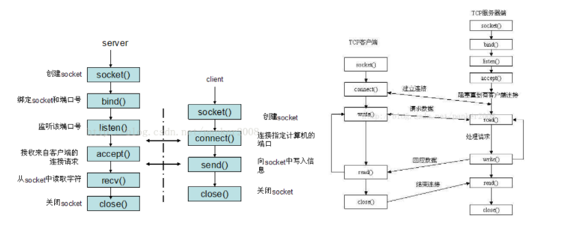
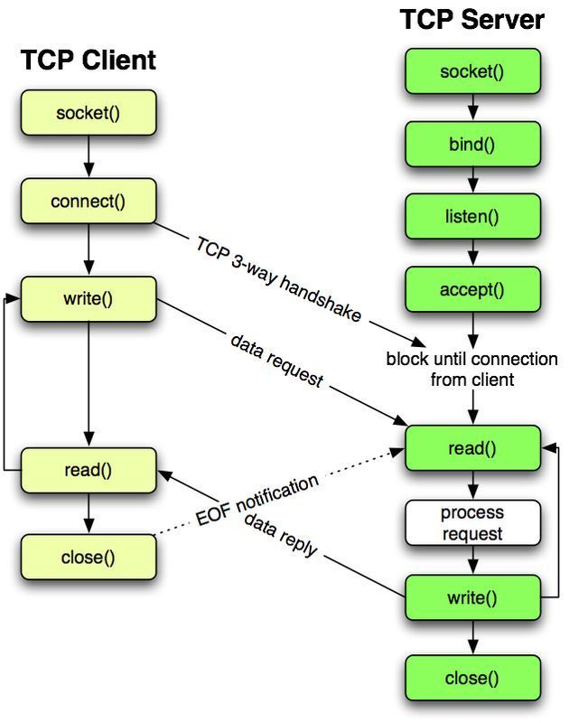

> socket套接字就是对网络中不同主机上的应用进程之间进行双向通信的端点的抽象。一个套接字就是网络上进程通信的一端，提供了应用层进程利用网络协议交换数据的机制。要通过互联网进行通信，至少需要一对套接字，其中一个运行于客户端，我们称之为Client Socket，另一个运行于服务器端，我们称之为Server Socket

# 1. socket套接字

socket的三次握手：

1. 第一次握手：客户端需要发送一个syn j 包，试着去链接服务器端，于是客户端我们需要提供一个链接函数
2. 第二次握手：服务器端需要接收客户端发送过来的syn J+1 包，然后在发送ack包，所以我们需要有服务器端接受处理函数
3. 第三次握手：客户端的处理函数和服务器端的处理函数

三次握手只是一个数据传输的过程，但是，我们传输前需要一些准备工作，比如将创建一个套接字，收集一些计算机的资源，将一些资源绑定套接字里面，以及接受和发送数据的函数等等，这些功能接口在一起构成了socket的编程




**server服务端：**
1. socket()：创建socket
2. bind():绑定socket和端口号
3. listen():监听该端口号
4. accept():接收来自客户端的连接请求（阻塞等待，使用循环）
5. recv():从socket中读取字符（接收socket客户端的消息，可使用子线程控制多个连接）
6. close():关闭socket

**client客户端：**
1. socket()：创建socket
2. connect()：连接指定计算机的端口（**和服务端的accept()连接**）
3. send()：向socket中写入信息（**和服务端的recv()连接**）
4. close()：关闭socket



***

# 2. 网络字节顺序与本地字节顺序之间的转换函数

+ 参考：[htons(), ntohl(), ntohs()，htons()这4个函数](https://blog.csdn.net/zhuguorong11/article/details/52300680)


在C/C++写网络程序的时候，往往会遇到字节的网络顺序和主机顺序的问题。这是就可能用到htons(), ntohl(), ntohs()，htons()这4个函数。
网络字节顺序与本地字节顺序之间的转换函数：

```shell
htonl()--"Host to Network Long"
ntohl()--"Network to Host Long"
htons()--"Host to Network Short"
ntohs()--"Network to Host Short"
```

**之所以需要这些函数是因为计算机数据表示存在两种字节顺序：NBO与HBO**

+ 网络字节顺序NBO(Network Byte Order): 按从高到低的顺序存储，在网络上使用统一的网络字节顺序，可以避免兼容性问题。

+ 主机字节顺序(HBO，Host Byte Order): 不同的机器HBO不相同，与CPU设计有关，数据的顺序是由cpu决定的,而与操作系统无关。

如 Intel x86结构下, short型数0x1234表示为34 12, int型数0x12345678表示为78 56 34 12  

如 IBM power PC结构下, short型数0x1234表示为12 34, int型数0x12345678表示为12 34 56 78

***

# 3. 查看socket连接的客户端和服务端信息

假设服务端端口号是8888

```shell
# adb shell
# netstat -ap |grep 8888
tcp        0      0 0.0.0.0:8888            0.0.0.0:*               LISTEN      2596/***_service
tcp        0      0 localhost:8888          localhost:45634         ESTABLISHED 2596/***_service
tcp        0      0 localhost:8888          localhost:45632         ESTABLISHED 2596/***_service
tcp6       0      0 localhost:45634         localhost:8888          ESTABLISHED 5336/com.***.upgrade
tcp6       0      0 localhost:45632         localhost:8888          ESTABLISHED 5002/com.***.engineeringmode
```

# 4. socket退出

UNIX网络编程（基本TCP套接字编程78页）给出了一个解释说的是：当我们关闭客户端后，客户端会发送一个数据（EOF，也就是0）

然后服务端通过`read()`函数收到这个数据,，知道了客户端已经退出，所以服务端也就退出了程序，并且调用相应的close操作


# 5. 参考

+ [htons(), ntohl(), ntohs()，htons()这4个函数](https://blog.csdn.net/zhuguorong11/article/details/52300680)
+ [bind：address already in use的深刻教训以及解决办法](https://blog.csdn.net/msdnwolaile/article/details/50743254)
