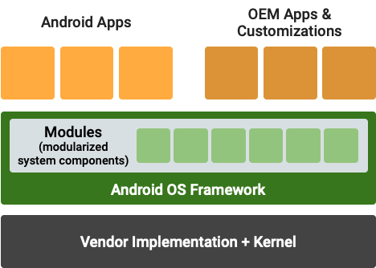
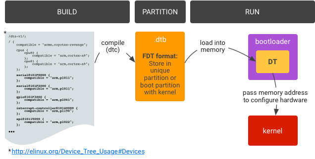
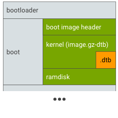
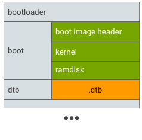

> 了解宏观上Android系统架构，硬件抽象层HAL层HIDL和AIDL接口定义语言、内核kernel、设备树叠加层DTO等

# 1. Android架构组件

+ 应用框架：应用框架最常被应用开发者使用。作为硬件开发者，需了解开发者API，因为很多此类API都可以直接映射到底层HAL接口，并可提供与实现驱动程序相关的实用信息
+ Binder IPC：Binder 进程间通信 (IPC) 机制允许应用框架跨越进程边界并调用Android系统服务代码，这使得高级框架API能与Android系统服务进行交互。在应用框架级别，开发者无法看到此类通信的过程，但一切似乎都在“按部就班地运行”
+ 系统服务。：统服务是专注于特定功能的模块化组件，例如窗口管理器、搜索服务或通知管理器。应用框架API所提供的功能可与系统服务通信，以访问底层硬件。Android 包含两组服务：“系统”（诸如窗口管理器和通知管理器之类的服务）和“媒体”（与播放和录制媒体相关的服务）。
+ 硬件抽象层 (HAL)：HAL 可定义一个标准接口以供硬件供应商实现，这可让Android忽略较低级别的驱动程序实现。借助HAL，可以顺利实现相关功能，而不会影响或更改更高级别的系统。HAL实现会被封装成模块，并会由Android系统适时地加载
+ Linux 内核：开发设备驱动程序与开发典型的Linux设备驱动程序类似。Android使用的Linux内核版本包含一些特殊的补充功能，例如低内存终止守护进程（一个内存管理系统，可更主动地保留内存）、唤醒锁定（一种 PowerManager 系统服务）、Binder IPC 驱动程序，以及对移动嵌入式平台来说非常重要的其他功能。这些补充功能主要用于增强系统功能，不会影响驱动程序开发


***

## 1.1. 模块化系统组件

> Android 10 或更高版本采用模块化方式来处理一些 Android 系统组件，使其能够在 Android 的常规发布周期外的时间进行更新。最终用户设备可以从 Google Play 商店基础架构或通过合作伙伴提供的无线下载 (OTA) 机制接收这些模块化系统组件的更新

***

### 1.1.1. [Android 10引入]APEX概念

> `Android Pony EXpress (APEX)`是Android 10中引入的一种容器格式，用于在较低级别系统模块的安装流程中使用。此格式可帮助更新不适用于标准Android应用模型的系统组件。一些示例组件包括原生服务和原生库、硬件抽象层 (HAL)、运行时 (ART) 以及类库

#### 1.1.1.1. apex 文件的构成

+ apex_manifest.json
+ AndroidManifest.xml
+ apex_payload.img
+ apex_pubkey

其中我们需要关注的是`apex_payload.img`和`apex_pubkey`

`apex_payload.img`是由`dm-verity`支持的ext4文件系统映像。各种原生常规文件包含在`apex_payload.img`文件中

`apex_pubkey`是用于为文件系统映像验签的公钥

#### 1.1.1.2. apex如何生成

apex在Android源码编译，需要进行相应的配置，然后编写相关的模块编译文件Android.bp，最终编译生成`unflatten`的apex文件

#### 1.1.1.3. apex安装方法

通过 packageInstaller 或者 adb 等安装工具安装

***

### 1.1.2. Android 12中的更新

#### 1.1.2.1. 新模块

1. [ART](https://source.android.google.cn/devices/architecture/modular-system/art)
2. [设备调度](https://source.android.google.cn/devices/architecture/modular-system/scheduling)

#### 1.1.2.2. 现有模块更新

|模块	|变更|
|:---|:---|
|adbd|	更新了模块边界
|DocumentsUI|	停用了文件浏览功能
|ExtServices	|添加了 DisplayHashingService<br>更新了模块边界|
|媒体	|添加了新的媒体组件|
|NNAPI 运行时|	更新了模块边界|
|PermissionController|使PermissionController 模块完全模块化<br>更新了模块边界|
|SDK扩展|更新了模块用途<br>添加了新组件|
|Statsd|更新了模块边界|
|网络共享|添加了功能<br>更新了模块边界|
|时区数据|更新了包格式|
|Wi-Fi|	更新了模块边界|

***

### 1.1.3. 架构

> Android 10或更高版本会将选定的系统组件转换为模块，其中一些模块采用APEX容器格式（在 Android 10 中引入），另一些则采用 APK 格式。借助模块化架构，系统组件能够根据需要以修复严重bug以及做出其他改进的方式进行更新，而不会影响较低级别的供应商实现或较高级别的应用和服务



模块更新不会引入新的API。它们仅使用由兼容性测试套件 (CTS) 保证的 SDK 和系统 API，并且只会彼此之间进行通信，且只使用稳定的 C API 或稳定的AIDL接口

可以将更新后的模块化系统组件打包在一起，并通过Google使用Google Play 商店基础架构）或Android合作伙伴（使用合作伙伴提供的OTA机制）将其推送到最终用户设备。模块软件包会以原子方式安装（和回滚），这意味着所有需要更新的模块都会进行更新，或者所有模块都不会进行更新。例如，如果某个需要更新的模块出于某种原因无法更新，设备不会安装软件包中的任何模块


***

### 1.1.4. 可用模块

> 详细变更描述参考：[Google官方说明文档](https://source.android.google.cn/devices/architecture/modular-system)

|模块名称|	软件包名称|	类型|	推出的版本|
|:---|:---|:---|:---|
|adbd|	com.android.adbd|	APEX|	Android 11|
|ART|	com.android.art|	APEX|	Android 12|
|强制门户登录	|com.android.captiveportallogin|	APK|	Android 10|
|CellBroadcast	|com.android.cellbroadcast|	APEX	|Android 11|
|Conscrypt	|com.android.conscrypt|	APEX	|Android 10|
|设备调度|	com.android.scheduling|	APEX	|Android 12|
|DNS 解析器|	com.android.resolv|	APEX	|Android 10|
|DocumentsUI|	com.android.documentsui	|APK|	Android 10|
|ExtServices	|com.android.ext.services	|APK (Android 10)|APEX (Android 11)|	Android 10
|IPsec/IKEv2 库|	com.android.ipsec	|APEX|	Android 11|
|媒体编解码器	|com.android.media.swcodec	|APEX	|Android 10|
|媒体	|com.android.media	|APEX	|Android 10（提取器、MediaSession API）<br> Android 11 (MediaParser API)
|MediaProvider|	com.android.mediaprovider|	APEX|	Android 11|
|ModuleMetadata|	com.android.modulemetadata|	APK	|Android 10|
|网络堆栈权限配置	|com.android.networkstack.permissionconfig|	APK|	Android 10|
|网络组件	|com.android.networkstack|	APK|	Android 10|
|NNAPI 运行时|	com.android.neuralnetworks	|APK|	Android 11|
|PermissionController|	com.android.permissioncontroller|	APK|	Android 10|
|SDK 扩展|	com.android.sdkext	|APEX|	Android 11|
|Statsd|	com.android.os.statsd|	APEX|	Android 11|
|网络共享|	com.android.tethering|	APK	|Android 11|
|时区数据|	com.android.tzdata|	APEX|	Android 10|
|Wi-Fi	|com.android.wifi.apex|	APEX|	Android 11|

***

## 1.2. 硬件抽象层（HAL层）

> HAL 可定义一个标准接口以供硬件供应商实现，这可让Android忽略较低级别的驱动程序实现。借助HAL，可以顺利实现相关功能，而不会影响或更改更高级别的系统

### 1.2.1. HAL类型

> [参考Google官方说明文档](https://source.android.google.cn/devices/architecture/hal-types)

在Android8.0及更高版本中，较低级别的层已重新编写以采用更加模块化的新架构。搭载Android8.0或更高版本的设备必须支持使用HIDL语言编写的HAL，下面列出了一些例外情况。这些HAL可以是绑定式HAL也可以是直通式HAL。

**Android11也支持使用AIDL编写的HAL。所有AIDLHAL均为绑定式。**

+ 绑定式HAL：以HAL接口定义语言(HIDL)或Android接口定义语言(AIDL)表示的HAL。这些HAL取代了早期Android版本中使用的传统HAL和旧版HAL。在绑定式HAL中，Android框架和HAL之间通过Binder进程间通信(IPC)调用进行通信。所有在推出时即搭载了Android8.0或后续版本的设备都必须只支持绑定式HAL。
+ 直通式HAL：以HIDL封装的传统HAL或旧版HAL。这些HAL封装了现有的HAL，可在绑定模式和Same-Process（直通）模式下使用。升级到Android8.0的设备可以使用直通式HAL

***

## 1.3. HAL接口定义语言 (AIDL/HIDL)

Android 8.0重新设计了Android操作系统框架（在一个名为“Treble”的项目中），以便让制造商能够以更低的成本更轻松、更快速地将设备更新到新版Android系统。

在这种新架构中，HAL接口定义语言（HIDL，发音为“hide-l”）指定了HAL和其用户之间的接口，让用户无需重新构建HAL，就能替换Android框架。

在Android 10中，HIDL功能已整合到`AIDL`中。此后，HIDL就被废弃了，并且仅供尚未转换为AIDL的子系统使用

***

### 1.3.1. HIDL

HAL接口定义语言（简称HIDL，发音为“hide-l”）是用于指定HAL和其用户之间的接口的一种接口描述语言(IDL)。HIDL允许指定类型和方法调用（会汇集到接口和软件包中）。从更广泛的意义上来说，HIDL是指用于在可以独立编译的代码库之间进行通信的系统。

**从Android10开始，HIDL已废弃，Android将在所有位置改用AIDL**

HIDL旨在用于进程间通信(IPC)。进程之间的通信采用Binder机制。对于必须与进程相关联的代码库，还可以使用直通模式（在Java中不受支持）

***

## 1.4. AIDL

> Android接口定义语言(AIDL)是一款可供用户用来抽象化IPC的工具。以在`.aidl`文件中指定的接口为例，各种构建系统都会使用aidl二进制文件构造C++或Java绑定，以便跨进程使用该接口（无论其运行时环境或位数如何）

AIDL可以在Android中的任何进程之间使用：在平台组件之间使用或在应用之间使用均可。

**但是，AIDL绝不能用作应用的API。例如，可以使用AIDL在平台中实现SDK API，但SDK API Surface绝不能直接包含AIDL API**

### 1.4.1. AIDL接口示例

**服务器进程注册接口并提供对它的调用，客户端进程则调用这些接口**

在许多情况下，进程既是客户端又是服务器，因为它可能会引用多个接口

```cpp
    package my.package;

    import my.package.Baz; // defined elsewhere

    interface IFoo {
        void doFoo(Baz baz);
    }
```

***

### 1.4.2. 工作原理

AIDL使用Binder内核驱动程序进行调用。

当发出调用时，系统会将方法标识符和所有对象打包到某个缓冲区中，然后将其复制到某个远程进程，该进程中有一个Binder线程正在等待读取数据。

Binder线程收到某个事务的数据后，该线程会在本地进程中查找原生桩对象，然后此类会解压缩数据并调用本地接口对象。

此本地接口对象正是服务器进程所创建和注册的对象。

当在同一进程和同一后端中进行调用时，不存在代理对象，因此直接调用即可，无需执行任何打包或解压缩操作。

***

### 1.4.3. AIDL使用步骤

Android 10添加了对稳定的Android接口定义语言(AIDL)的支持，这是一种跟踪由AIDL接口提供的应用编程接口(API)/应用二进制接口(ABI)的新方法

#### 1.4.3.1. 定义AIDL接口

aidl_interface的定义如下：

```cpp
//可以参考update_engine模块system/update_engine/stable/Android.bp中aidl_interface使用
aidl_interface {
    //AIDL 接口模块的名称，能唯一标识 AIDL 接口
    name: "my-aidl",
    //组成接口的AIDL源文件的列表
    //软件包com.acme中定义的AIDL类型Foo的路径应为<base_path>/com/acme/Foo.aidl，
    //其中<base_path>可以是与Android.bp所在目录相关的任何目录
    //在以上示例中，<base_path>为srcs/aidl
    srcs: ["srcs/aidl/**/*.aidl"],
    //软件包名称以此路径开头。此路径与上述 <base_path> 相对应
    local_include_dir: "srcs/aidl",
    //此接口要导入的其他 AIDL 接口模块的可选列表
    //可通过import语句访问导入的AIDL接口中定义的AIDL类型
    imports: ["other-aidl"],
    //冻结在 api_dir 下的接口的先前版本。从 Android 11 开始，versions 冻结在 aidl_api/name 下
    //如果没有已冻结的接口版本，就不应指定此属性，且不会进行兼容性检查
    versions: ["1", "2"],
    //可选标记，用于承诺此接口的稳定性。目前仅支持 "vintf"。
    //如果未设置此属性，这意味着接口在此编译环境下才具有稳定性
    //如果将此标记设为 "vintf"，这表示做出了稳定性承诺：只要有代码使用此接口，接口就必须保持稳定
    stability: "vintf",
    //这些标记用于切换后端的启用状态，AIDL编译器会为这些后端生成代码。目前支持3个后端：java、cpp和ndk
    backend: {
        java: {
            enabled: true,
            platform_apis: true,
        },
        cpp: {
            enabled: true,
        },
        ndk: {
            enabled: true,
        },
    },
}
```

***

### 1.4.4. 编写AIDL文件

稳定AIDL的最大不同就在于如何定义Parcelable。以前，Parcelable是前向声明的，而在稳定的AIDL中，Parcelable字段和变量是显式定义的

现在支持boolean、char、float、double、byte、int、long和String的默认值（但不是必需的）

```cpp
// in a file like 'some/package/Thing.aidl'
package some.package;

parcelable SubThing {
    String a = "foo";
    int b;
}
```

***

### 1.4.5. 引用AIDL库

**在Android.mk引用：**

```shell
cc_... {
    name: ...,
    shared_libs: ["my-module-name-cpp"],
    ...
}
# or
java_... {
    name: ...,
    // can also be shared_libs if desire is to load a library and share
    // it among multiple users or if you only need access to constants
    static_libs: ["my-module-name-java"],
    ...
}
```

**C++语言示例：**

```cpp
#include "some/package/IFoo.h"
#include "some/package/Thing.h"
...
    // use just like traditional AIDL
```

**java语言示例：**

```java
import some.package.IFoo;
import some.package.Thing;
...
    // use just like traditional AIDL
```

***

### 1.4.6. 编写AIDLHAL接口

为了让系统和供应商都可使用某个AIDL接口，需要对该接口进行两项更改：

+ 每个类型定义都需要带有`@VintfStability`注释
+ `aidl_interface`声明需要包含`stability:"vintf"`,只有接口所有者可以进行这些更改。

此外，为了最大限度地提高代码可移植性并避免出现潜在问题（例如不必要的额外库），Google建议停用CPP后端

```cpp
    aidl_interface: {
        ...
        backends: {
            cpp: {
                enabled: false,
            },
        },
    }
```

***

### 1.4.7. 查找AIDL HAL接口

AOSP中HAL的稳定AIDL接口所在的基础目录与HIDL接口所在的基础目录相同，位于aidl文件夹中

+ hardware/interfaces
+ frameworks/hardware/interfaces
+ system/hardware/interfaces

应将扩展接口放入vendor或hardware中的其他`hardware/interfaces`子目录。强烈建议在所有设备之间保持接口一致。扩展可以通过两种不同方式进行注册：

1. 在运行时注册
2. 独立注册（在全局注册和在VINTF内注册）

***

### 1.4.8. AIDL HAL实例名称

按照惯例，AIDL HAL服务的实例名称应采用以下格式：`$package.$type/$instance`

例如，AIDL HAL实例的注册名称为`android.hardware.vibrator.IVibrator/default`

***

#### 1.4.8.1. XML注册AIDL

**必须在VINTF清单中声明AIDL服务器，示例如下：**

```shell
    <hal format="aidl">
        <name>android.hardware.vibrator</name>
        <fqname>IVibrator/default</fqname>
    </hal>
```

***

#### 1.4.8.2. AIDL客戶端声明实例

**AIDL客户端必须在兼容性矩阵中声明自己，示例如下：**

```shell
    <name>android.hardware.vibrator</name>
    <interface>
        <name>IVibrator</name>
        <instance>default</instance>
    </interface>
```

***

### 1.4.9. 将HIDL转换为AIDL

使用hidl2aidl工具将HIDL接口转换为AIDL。按照下面的步骤操作，将.hal文件包转换为.aidl文件：

1. 构建该工具（位于 system/tools/hidl/hidl2aidl 中）:`m hidl2aidl`
2. 使用以下命令执行该工具：输出目录，后接要转换的文件包：`hidl2aidl -o <output directory> <package>`

例如:`hidl2aidl -o . android.hardware.nfc@1.2`

3. 仔细阅读生成的文件，并解决任何转换方面的问题。

+ conversion.log包含应该先解决的所有尚未解决的问题。
+ 生成的.aidl文件可能包含一些需要您进行相应处理的警告和建议。这些注释以//开头。
+ 对文件包进行清理并加以改进

***

### 1.4.10. 适用于AIDL HAL的sepolicy

> 对供应商代码可见的AIDL服务类型必须具有vendor_service属性。否则，sepolicy配置将与任何其他AIDL服务相同。

`type hal_power_service, service_manager_type, vendor_service;`

对于平台定义的大多数服务，已经添加了具有正确类型的服务上下文（例如，`android.hardware.power.IPower/default`已标记为`hal_power_service`）。

但是，如果框架客户端支持多种实例名称，则必须在设备专用`service_contexts`文件中添加其他实例名称

`android.hardware.power.IPower/custom_instance u:object_r:hal_power_service:s0`

***

## 1.5. AIDL与HIDL之间的主要差异

**使用AIDLHAL或使用AIDLHAL接口时，请注意与编写HIDLHAL的差异：**

+ AIDL语言的语法更接近Java，HIDL语言的语法类似于C++
+ 所有AIDL接口都具有内置的错误状态。不要创建自定义状态类型，而应在接口文件中创建常量状态int，并在CPP/NDK后端使用`EX_SERVICE_SPECIFIC`，在Java后端使用`ServiceSpecificException`
+ 未经检查的传输错误不会导致AIDL终止运行（未经检查的错误会导致HIDL Return终止运行）
+ AIDL只能为每个文件声明一种类型
+ 除了output参数外，AIDL参数还可以指定为in/out/inout（没有“同步回调”）
+ AIDL将`fd`用作基元类型，而不是句柄
+ HIDL对不兼容的更改使用Major版本，对兼容的更改使用Minor版本。在AIDL中，向后兼容的更改已就位。AIDL没有对Major版本进行明确定义，而是将其并入软件包名称中。**例如，AIDL可能会使用软件包名称bluetooth2**

***

# 2. configure配置（系统属性）

> **Android 10因ConfigStore HAL内存耗用量高且难以使用而将其弃用，并用系统属性替换了这个HAL**

**系统属性使用`PRODUCT_DEFAULT_PROPERTY_OVERRIDES`在供应商分区的`default.prop`中存储系统属性，服务使用sysprop读取这些属性**

## 2.1. sysprop系统属性示例

例如SurfaceFlingerProperties系统属性，代码文件`frameworks/native/services/surfaceflinger/sysprop/SurfaceFlingerProperties.sysprop`

函数名称是SurfaceFlingerProperties.sysprop中的`api_name`:

```shell
prop {
    api_name: "vsync_event_phase_offset_ns"
    type: Long
    scope: Public
    access: Readonly
    prop_name: "ro.surface_flinger.vsync_event_phase_offset_ns"
}

cc_binary {
    name: "cc_client",
    srcs: ["baz.cpp"],
    shared_libs: ["SurfaceFlingerProperties"],
}
java_library {
    name: "JavaClient",
    srcs: ["foo/bar.java"],
    libs: ["SurfaceFlingerProperties"],
}
```

+ **java使用方法：**

```java
//直接引用文件
import android.sysprop.SurfaceFlingerProperties;
...
static void foo() {
    ...
    boolean temp = SurfaceFlingerProperties.vsync_event_phase_offset_ns().orElse(true);
    ...
}
...
```

+ **C++使用方法：**

```cpp
//引用命名空间
#include <SurfaceFlingerProperties.sysprop.h>
using namespace android::sysprop;
...
void bar() {
    ...
    bool temp = SurfaceFlingerProperties::vsync_event_phase_offset_ns(true);
    ...
}
...
```
***

## 2.2. 系统属性API

系统属性是在系统范围内共享信息（通常是配置）的一种便捷方式。每个分区都可以在内部使用自己的系统属性

从Android 10版本开始，跨分区访问的系统属性已架构化为Sysprop说明文件，并且用于访问属性的API会生成为C++具体函数和Java类

### 2.2.1. 将系统属性定义为API

可以使用Sysprop说明文件(.sysprop)将系统属性定义为API，该文件使用protobuf的TextFormat，其架构如下：

**这些类型定义可以用于上面sysprop系统属性文件中**

```cpp
// File: system/tools/sysprop/sysprop.proto
syntax = "proto3";

package sysprop;

enum Access {
  Readonly = 0;
  Writeonce = 1;
  ReadWrite = 2;
}
//设为拥有属性的分区：Platform、Vendor 或 Odm
enum Owner {
  Platform = 0;
  Vendor = 1;
  Odm = 2;
}

enum Scope {
  Public = 0;
  Internal = 2;
}

enum Type {
  Boolean = 0;
  Integer = 1;
  Long = 2;
  Double = 3;
  String = 4;
  Enum = 5;

  BooleanList = 20;
  IntegerList = 21;
  LongList = 22;
  DoubleList = 23;
  StringList = 24;
  EnumList = 25;
}

message Property {
    //生成的 API 的名称
  string api_name = 1;
  //此属性的类型
  Type type = 2;
  //Readonly：仅生成 getter API
  //Writeonce、ReadWrite：生成 getter 和 setter API
  //注意：带有 ro. 前缀的属性不能使用 ReadWrite 访问权限
  Access access = 3;
  //Internal：只有所有者可以访问
  //Public：全部都可以访问，但 NDK 模块除外
  Scope scope = 4;
  //底层系统属性的名称，例如 ro.build.date
  string prop_name = 5;
  //（仅 Enum 和 EnumList）一个竖条 (|) 分隔的字符串，由可能的枚举值组成。例如，value1|value2
  string enum_values = 6;
  //（仅 Boolean 和 BooleanList）让 setter 使用 0 和 1，而不是 false 和 true
  bool integer_as_bool = 7;
  //可选，仅限 Readonly 属性）底层系统属性的旧名称
  string legacy_prop_name = 8;
}

message Properties {
    //设为拥有属性的分区：Platform、Vendor 或 Odm
  Owner owner = 1;
  //用于创建放置生成的 API 的命名空间 (C++) 或静态最终类 (Java)
  //例如，com.android.sysprop.BuildProperties 
  //将是 C++ 中的命名空间 com::android::sysprop::BuildProperties，
  //并且也是 Java 中 com.android.sysprop 中的软件包中的 BuildProperties 类
  string module = 2;
  //属性列表
  repeated Property prop = 3;
}
```

***

#### 2.2.1.1. 定义系统属性API示例

```cpp
# File: frameworks/native/services/surfaceflinger/sysprop/SurfaceFlingerProperties.sysprop

module: "android.sysprop.SurfaceFlingerProperties"
owner: Platform

prop {
    api_name: "vsync_event_phase_offset_ns"
    type: Long
    scope: Public
    access: Readonly
    prop_name: "ro.surface_flinger.vsync_event_phase_offset_ns"
}

prop {
    api_name: "vsync_sf_event_phase_offset_ns"
    type: Long
    scope: Public
    access: Readonly
    prop_name: "ro.surface_flinger.vsync_sf_event_phase_offset_ns"
}
```

***

### 2.2.2. 定义系统属性库

可以使用Sysprop说明文件定义sysprop_library模块。

sysprop_library用作C++和Java的API。

对于sysprop_library的每个实例，构建系统会在内部生成一个java_library和一个cc_library

例如：

```shell
// File: frameworks/native/services/surfaceflinger/sysprop/Android.bp
sysprop_library {
    name: "SurfaceFlingerProperties",
    srcs: ["*.sysprop"],
    api_packages: ["android.sysprop"],
    property_owner: "Platform",
}
```

***

### 2.2.3. API检查

必须在源代码中包含API列表文件以进行API检查。

为此，请创建API文件和一个api目录。将api目录放在与Android.bp相同的目录中。

API文件名包括`<module_name>-current.txt`和`<module_name>-latest.txt`

+ `<module_name>-current.txt`保留当前源代码的API签名
+ `<module_name>-latest.txt`保留最新的冻结API签名。构建系统通过在构建时比较这些API文件和生成的API文件来检查API是否已更改，并在current.txt与源代码不匹配时发出错误消息和更新current.txt文件的说明

**例如surfacefilinger模块中：**

```shell
//frameworks/native/services/surfaceflinger/sysprop/
- api
- - SurfaceFlingerProperties-current.txt
- - SurfaceFlingerProperties-latest.txt
- Android.bp
- SurfaceFlingerProperties.sysprop	
```

***

Java和C++客户端模块都可以关联到sysprop_library以使用生成的API。构建系统会创建从客户端到生成的C++和Java库的关联，从而使客户端能够访问生成的API

```shell
java_library {
    name: "JavaClient",
    srcs: ["foo/bar.java"],
    libs: ["PlatformProperties"],
}

cc_binary {
    name: "cc_client",
    srcs: ["baz.cpp"],
    shared_libs: ["PlatformProperties"],
}
```

+ Java访问定义属性示例：

```java
import android.sysprop.PlatformProperties;
…
static void foo() {
    …
    Integer dateUtc = PlatformProperties.date_utc().orElse(-1);
    …
}
…
```

+ C++访问定义属性示例：

```cpp
#include <android/sysprop/PlatformProperties.sysprop.h>
using namespace android::sysprop;
…
void bar() {
    …
    std::string build_date = PlatformProperties::build_date().value_or("(unknown)");
    …
}
…
```

***


***

# 3. 内核

> Android 内核基于上游 Linux 长期支持 (LTS) 内核。在 Google，LTS 内核会与 Android 专用补丁结合，形成所谓的“Android 通用内核 (ACK)”

较新的ACK（版本5.4及更高版本）也称为GKI内核，因为它们支持将与硬件无关的通用核心内核代码和与硬件无关的GKI模块分离开来。

GKI内核会与包含系统芯片(SoC)和板级代码的硬件专用供应商模块进行交互。

GKI内核与供应商模块之间的交互通过内核模块接口(KMI)来实现，该接口由标识供应商模块所需的函数和全局数据的符号列表组成。

如图显示GKI内核和供应商模块架构：


***

## 3.1. 内核术语

1. 内核类型

+ Android 通用内核 (ACK)：ACK是长期支持(LTS)内核的下游，包含与Android社区相关但尚未合并到Linux Mainline或LTS内核的补丁。较新的ACK（版本 5.4 及更高版本）也称为GKI内核，因为它们支持将与硬件无关的通用内核代码和与硬件无关的GKI模块分离开来
+ Android 开源项目 (AOSP) 内核：Android通用内核
+ 功能内核：确保实现平台版本功能的内核。例如，在Android 12中，两个功能内核为android12-5.4和android12-5.10。Android 12功能无法向后移植到4.19内核，功能集与在发布时搭载R4.19并升级到S的设备类似
+ 通用内核映像 (GKI) 内核：任何较新的（5.4及更高版本）ACK内核（目前仅限aarch64）。此内核包含两个部分：代码在所有设备上通用的GKI核心内核，以及由Google开发的可在设备上（如适用）动态加载的GKI内核模块
+ 内核模块接口 (KMI) 内核
+ **启动内核：对于启动指定Android平台版本的设备有效的内核。例如，在Android 12中，有效的启动内核为4.19、5.4和5.10**
+ 长期支持 (LTS) 内核：受支持2到6年的Linux内核。LTS内核每年发布一次，是Google每个ACK的基础

2. 分支类型

+ ACK KMI内核分支：构建GKI内核的分支。例如，android12-5.10和android13-5.15
+ Android-mainline：Android功能的主要开发分支。当上游声明新的LTS内核时，相应的新GKI内核就会从android-mainline分支出来
+ LinuxMainline：上游Linux内核（包括LTS内核）的主要开发分支

***

## 3.2. 模块化内核

### 3.2.1. Fstab配置分区

在Android9及更低版本中，设备可以使用设备树叠加层(DTO)为提前装载的分区指定fstab条目。在Android10及更高版本中，设备必须使用第一阶段ramdisk中的fstab文件为提前装载的分区指定fstab条目。

Android10引入了以下可在fstab文件中使用的`fs_mgr`标记：

+ first_stage_mount表明将由第一阶段init装载分区
+ **logical表明这是一个动态分区**
+ avb=vbmeta-partition-name：可指定vbmeta分区。第一阶段init可初始化该分区，然后再装载其他分区。如果该条目的vbmeta分区已由上一行中的其他fstab条目指定，可以省略此标记的参数

**以下示例展示了将system、vendor和product分区设置为逻辑（动态）分区的fstab条目：**

```shell
#<dev>  <mnt_point> <type>  <mnt_flags options> <fs_mgr_flags>
system   /system     ext4    ro,barrier=1     wait,slotselect,avb=vbmeta_system,logical,first_stage_mount
vendor   /vendor     ext4    ro,barrier=1     wait,slotselect,avb=vbmeta,logical,first_stage_mount
product  /product    ext4    ro,barrier=1     wait,slotselect,avb,logical,first_stage_mount
```

在上述示例中，供应商使用fs_mgr标记avb=vbmeta指定了vbmeta分区，但product省略了vbmeta参数，因为供应商已将vbmeta添加到了分区列表。

**搭载Android10及更高版本的设备必须将fstab文件放在ramdisk和vendor分区中**

***

#### 3.2.1.1. 放置Ramdisk位置

**fstab文件在ramdisk中的位置取决于设备如何使用ramdisk**

1. `具有启动ramdisk的设备`必须将fstab文件放在启动ramdisk根目录中。如果设备同时具有启动ramdisk和恢复ramdisk，就无需对恢复ramdisk进行任何更改。示例：

`PRODUCT_COPY_FILES +=  device/google/<product-name>/fstab.hardware:$(TARGET_COPY_OUT_RAMDISK)/fstab.$(PRODUCT_PLATFORM)`

1. `将恢复用作ramdisk的设备`必须使用内核命令行参数`androidboot.force_normal_boot=1`来决定是启动到Android还是继续启动到恢复模式。发布时搭载Android 12或更高版本且内核版本为5.10或更高版本的设备必须使用bootconfig传递`androidboot.force_normal_boot=1`参数。在这些设备中，第一阶段init在装载提前装载分区之前将根操作切换到了`/first_stage_ramdisk`，因此设备必须将fstab文件放在`$(TARGET_COPY_OUT_RECOVERY)/root/first_stage_ramdisk中`。示例：

`PRODUCT_COPY_FILES +=  device/google/<product-name>/fstab.hardware:$(TARGET_COPY_OUT_RECOVERY)/root/first_stage_ramdisk/fstab.$(PRODUCT_PLATFORM)`

***

#### 3.2.1.2. 放置vendor分区

**所有设备都必须将fstab文件的副本放到/vendor/etc中。**

这是因为第一阶段init在完成分区提前装载之后释放了ramdisk，并执行了切换根操作，以将位于`/system`的装载移动到了`/`。因此，后续任何需要访问fstab文件的操作都必须使用`/vendor/etc`中的副本。示例：

`PRODUCT_COPY_FILES +=  device/google/<product-name>/fstab.hardware:$(TARGET_COPY_OUT_VENDOR)/etc/fstab.$(PRODUCT_PLATFORM)`

***

### 3.2.2. 提前装载分区，VBoot 1.0

使用VBoot 1.0提前装载分区的要求包括：

1. 设备节点路径必须在fstab和设备树条目中使用其by-name符号链接。例如，确保对分区进行命名且设备节点为`/dev/block/…./by-name/{system,vendor,odm}`，而不是使用`/dev/block/mmcblk0pX`指定分区
2. 在产品的设备配置中（即`device/oem/project/device.mk`中）为`PRODUCT_{SYSTEM,VENDOR}_VERITY_PARTITION`和`CUSTOM_IMAGE_VERITY_BLOCK_DEVICE`指定的路径必须与`fstab/`设备树条目中相应块设备节点指定的`by-name`相匹配。示例：

```shell
PRODUCT_SYSTEM_VERITY_PARTITION := /dev/block/…./by-name/system
PRODUCT_VENDOR_VERITY_PARTITION := /dev/block/…./by-name/vendor
CUSTOM_IMAGE_VERITY_BLOCK_DEVICE := /dev/block/…./by-name/odm
```

3. 通过设备树叠加层提供的条目不得在fstab文件`Fragment`中出现重复。例如，指定某个条目以在设备树中装载`/vendor`时，fstab文件不得重复该条目
4. 不得提前装载需要`verifyatboot`的分区（此操作不受支持）
5. 必须在`kernel_cmdline`中使用`androidboot.veritymode`选项指定验证分区的真实模式/状态（现有要求)

***

### 3.2.3. 提前装载设备树，VBoot 1.0

在Android8.x及更高版本中，init会解析设备树并创建fstab条目，以在其第一阶段提前装载分区。fstab条目采用以下形式：

`src mnt_point type mnt_flags fs_mgr_flags`

**定义设备树属性以模拟该格式：**

+ fstab条目必须在设备树中的`/firmware/android/fstab`下，且必须将兼容字符串设置为`android`,`fstab`
+ `/firmware/android/fstab`下的每个节点都被视为单个提前装载fstab条目。节点必须定义以下属性：
+ + dev必须指向表示by-name分区的设备节点
+ + type必须是文件系统类型（如在fstab文件中一样）
+ `mnt_flags`必须是装载标记的逗号分隔列表（如在fstab文件中一样）
+ `fsmgr_flags`必须是`Androidfs_mgrflags`列表（如在fstab文件中一样）
+ **A/B分区必须具有slotselectfs_mgr选项**
+ **已启用dm-verity的分区必须具有verifyfs_mgr选项**

***

#### 3.2.3.1. 示例

下面的示例显示的是在 Pixel 上为 /vendor 提前装载设备树（请务必为 A/B 分区添加 slotselect）:

```shell
/ {
  firmware {
    android {
      compatible = "android,firmware";
      fstab {
        compatible = "android,fstab";
        vendor {
          compatible = "android,vendor";
          dev = "/dev/block/platform/soc/624000.ufshc/by-name/vendor";
          type = "ext4";
          mnt_flags = "ro,barrier=1,discard";
          fsmgr_flags = "wait,slotselect,verify";
        };
      };
    };
  };
};
```

***

### 3.2.4. 提前装载分区，VBoot 2.0

**VBoot2.0是Android启动时验证(AVB)**

使用VBoot2.0提前装载分区的要求如下：

+ 设备节点路径必须在fstab和设备树条目中使用其by-name符号链接。例如，确保对分区进行命名且设备节点为`/dev/block/…./by-name/{system,vendor,odm}`，而不是使用`/dev/block/mmcblk0pX`指定分区
+ **VBoot1.0所用的构建系统变量（如`PRODUCT_{SYSTEM,VENDOR}_VERITY_PARTITION`和`CUSTOM_IMAGE_VERITY_BLOCK_DEVICE`）对VBoot2.0而言并不是必需的。应定义VBoot2.0中引入的构建变量（包括`BOARD_AVB_ENABLE:=true`）**
+ 通过设备树叠加层提供的条目不得在fstab文件Fragment中出现重复。例如，如果您指定某个条目以在设备树中装载`/vendor`，fstab文件不得重复该条目
+ VBoot2.0不支持verifyatboot，无论是否启用了提前装载
+ 必须在`kernel_cmdline`中使用`androidboot.veritymode`选项指定验证分区的真实模式/状态（现有要求）

***

### 3.2.5. 提前装载设备树，VBoot 2.0

VBoot2.0设备树中的配置与VBoot1.0中的大致相同，但还有以下几项不同之处：

+ **fsmgr_flag由verify变为avb**
+ 包含AVB元数据的所有分区都必须位于设备树的`VBMeta`条目中，即使相应的分区并非提前装载的分区（如`/boot`）也是如此

***

#### 3.2.5.1. 示例

下面的示例显示的是在 Pixel 上提前装载 /vendor。注意：

+ 很多分区都是在`vbmeta`条目中指定的，因为这些分区受AVB保护
+ 请务必包含所有`AVB`分区，即使仅提前装载了`/vendor`也是如此
+ 请务必为A/B分区添加`slotselect`

```shell
/ {
  vbmeta {
    compatible = "android,vbmeta";
    parts = "vbmeta,boot,system,vendor,dtbo";
  };
  firmware {
    android {
      compatible = "android,firmware";
      fstab {
        compatible = "android,fstab";
        vendor {
          compatible = "android,vendor";
          dev = "/dev/block/platform/soc/624000.ufshc/by-name/vendor";
          type = "ext4";
          mnt_flags = "ro,barrier=1,discard";
          fsmgr_flags = "wait,slotselect,avb";
        };
      };
    };
  };
};
```

***

### 3.2.6. 文件系统节点释义

> [Google官方文档设备节点说明](https://source.android.google.cn/devices/architecture/kernel/reqs-interfaces)

Linux内核可通过多个文件系统导出接口。

Android要求这些接口以相同的格式传递相同的信息，并且提供的语义与上游Linux内核中的语义相同。

对于上游中不存在的接口，相应的行为将由对应的Android通用内核分支决定

**列出部分节点：**

#### 3.2.6.1. `/proc/*`节点

|接口	|说明|
|:---|:---|
|/proc/asound/|	用于显示当前已配置 ALSA 驱动程序列表的只读文件|
|/proc/cmdline	|只读文件，包含传递到内核的命令行参数|
|/proc/config.gz	|包含内核构建配置的只读文件|
|/proc/cpuinfo|	包含架构对应的 CPU 详细信息的只读文件|
|/proc/diskstats|	用于显示块设备的 I/O 统计信息的只读文件|
|/proc/filesystems|	列出内核当前支持的文件系统的只读文件|
|/proc/kmsg	|实时显示内核信息的只读文件|
|/proc/loadavg|	用于显示特定时间段内平均 CPU 负载和 I/O 负载的只读文件|
|/proc/meminfo|	显示内存子系统详细信息的只读文件|
|/proc/stat|	包含各种内核和系统统计信息的只读文件|
|/proc/swaps|	用于显示交换空间利用情况的只读文件。此文件是可选的；只有在该文件存在时，系统才会在 VTS 中验证其内容和权限|
|/proc/uptime|	显示系统运行时间的只读文件|
|/proc/version|	包含描述内核版本的字符串的只读文件|
|/proc/vmallocinfo|	只读文件，包含 vmalloc 进行分配的范围|
|/proc/vmstat	|只读文件，包含来自内核的虚拟内存统计信息|
|/proc/zoneinfo	|包含内存区域相关信息的只读文件|

***

#### 3.2.6.2. `/dev/*`节点

|接口	|说明|
|:---|:---|
|/dev/ashmem|	匿名的共享内存设备文件|
|/dev/binder|	Binder 设备文件|
|/dev/hwbinder|	硬件 binder 设备文件|
|/dev/tun|	通用 TUN/TAP 设备文件|
|/dev/xt_qtaguid	|QTAGUID netfilter 设备文件|

***

#### 3.2.6.3. `/sys/*`节点

|接口	|说明|
|:---|:---|
|/sys/class/net/*/mtu	|包含每个接口的最大传输单元的读写文件|
|/sys/class/rtc/*/hctosys|	只读文件，显示特定 rtc 是否在启动和恢复时提供系统时间|
|/sys/devices/system/cpu/	|包含 CPU 配置和频率相关信息的目录|

***

#### 3.2.6.4. selinuxfs节点

框架会将 selinuxfs 装载到 /sys/fs/selinux 中

|接口	|说明|
|:---|:---|
|/sys/fs/selinux/checkreqprot	|读/写文件，包含可用于确定如何在 mmap 和 mprotect 调用中检查 SElinux 保护的二进制标记|
|/sys/fs/selinux/null|	供 SElinux 使用的读/写空设备|
|/sys/fs/selinux/policy	|只读文件，包含二进制文件形式的 SElinux 政策|


***

## 3.3. 设备树叠加层（DTO）

> 设备树 (DT)是用于描述“不可发现”硬件的命名节点和属性构成的一种数据结构。操作系统（例如在 Android 中使用的Linux内核）会使用DT来支持Android设备使用的各种硬件配置。硬件供应商会提供自己的 DT 源文件，接下来 Linux 会将这些文件编译到引导加载程序使用的设备树Blob (DTB) 文件中

### 3.3.1. 加载设备树

> [参考google官方文档设备树叠加层](https://source.android.google.cn/devices/architecture/dto)

在引导加载程序中加载设备树会涉及到构建、分区和运行:



**1. 如需构建，请执行以下操作：**
+ 使用设备树编译器(dtc)将设备树源(.dts)编译成设备树blob(.dtb)，将其格式设置为扁平化设备树
+ 将.dtb文件刷写到引导加载程序在运行时可访问的位置

**启动分区:将.dtb放在启动分区中，方法是将其附加到image.gz，并作为“kernel”传递给mkbootimg**


**唯一分区：将.dtb放在唯一分区（例如dtb分区）中**


1. 如需进行分区，请确定闪存中引导加载程序在运行时可访问的可信位置以放置.dtb
2. 如需运行，请执行以下操作：
+ 将.dtb从存储空间加载到内存中
+ 启动内核（已给定所加载DT的内存地址）

***

# 4. 参考

+ [Android apex 学习总结](http://kevinems.com/software-development/762.html)
+ [Google官方开发文档](https://source.android.google.cn/devices/architecture)