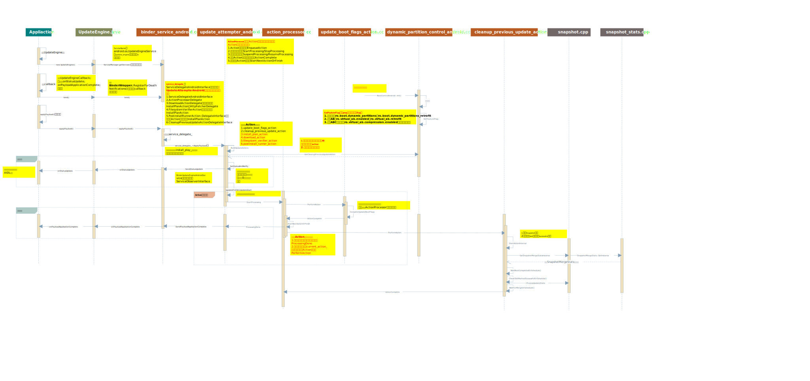
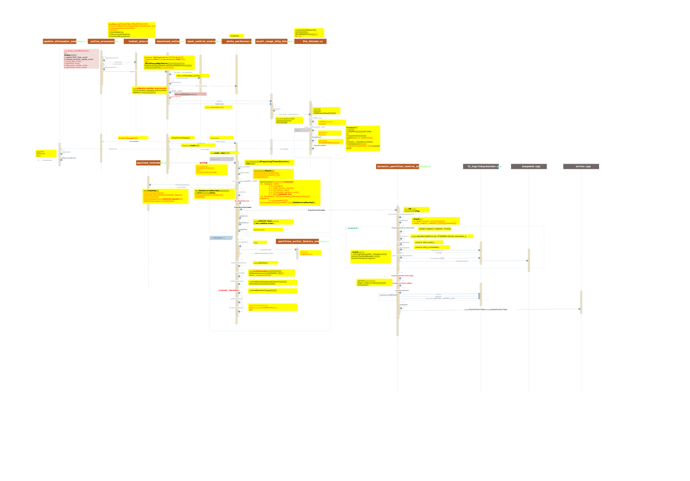
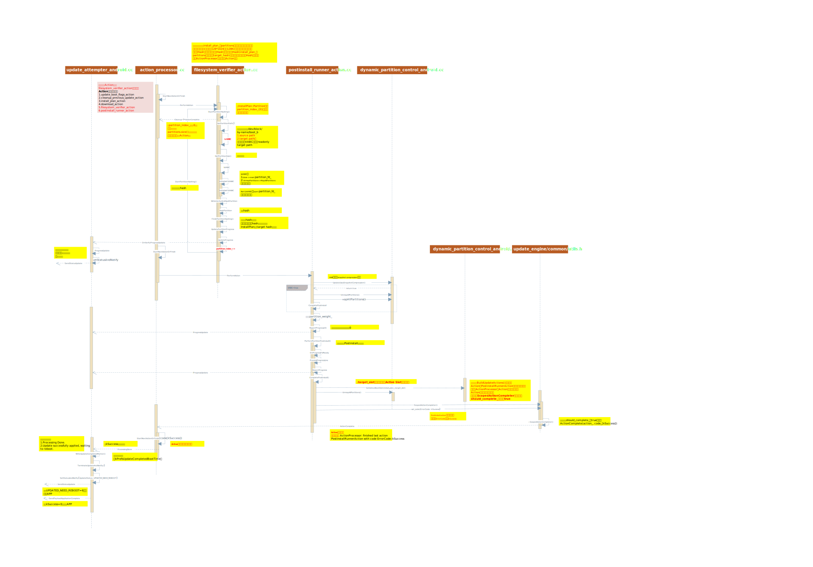

> Android A/B升级又称静默升级，它是一种在系统运行过程中进行的升级功能。为了减小系统运行负荷，整个升级过程会保持在一个较低的IO状态，所以升级时间比recovery升级明显要长。**本文是基于Android 12 AOSP源码，对update engine模块的流程进行梳理，最主要的内容是绘制的几张序列图。**


# 1. 概述

update_engine升级会依次执行四个主要的升级动作：InstallAction，DownloadAction，FilesystemVerfierAction，PostinstallRunnerAction。启动DownloadAction和PostinstallRunnerAction耗时最长。

DownloadAction是执行具体的升级拷贝动作，将镜像文件中的内容拷贝到缓冲区，然后写入到指定分区，这一步的时间不容易缩减。

PostinstallRunnerAction是根据post install script进行预编译工作，将target_slot标记为active。

> 源码：system/update_engine/

Android 10引入动态分区概念，即VAB升级；Android 12引入VABC升级，即增加了一个compression压缩概念

***

# 2. API接口调用

## 2.1. APP调用UpdateEngine示例代码

> 原生的升级参考示例APK：packages/apps/Car/SystemUpdater
> 
> `adb shell am start com.android.car.systemupdater/.SystemUpdaterActivity`

```java
//以下是简单的demo app截取代码
private String[] mUpdateHeader = null;
private UpdateEngine mUpdateEngine = null;
//创建对象
mUpdateEngine = new UpdateEngine();
File file = new File(filePath);  //升级包文件
String fileName = file.getName();
PayloadSpec payloadSpec = getUpdateHeader(file);
```


```java
final long size = payloadSpec.getSize();
final long offset = payloadSpec.getOffset();
final String url = payloadSpec.getUrl();
List<String> specList = payloadSpec.getProperties();
mUpdateHeader = specList.toArray(new String[specList.size()]);

//bind绑定
mUpdateEngine.bind(new UpdateEngineCallback() {
    //重写onStatusUpdate接口
    @Override
    public void onStatusUpdate(int aStatus, float aPercent) {
        float iaPercent = aPercent * 100;
        miUpdateProgress = Math.round(iaPercent);
        LU.w(tag, "onStatusUpdate()         aStatus== " + aStatus +
                "   iaPercent==" + iaPercent + "  " + miUpdateProgress);
        sendMessage(UPDATE_BEING, aStatus);
    }
    //重写onPayloadApplicationComplete接口
    @Override
    public void onPayloadApplicationComplete(int errCode) {
        LU.w(tag, "onPayloadApplicationComplete()         errCode== " + errCode);
        sendTimeMessage(UPDATE_RESULT, errCode);
    }
});
//调用applyPayload，传入升级需要的参数
mUpdateEngine.applyPayload(url, offset, size, mUpdateHeader);
```

**主要内容：**
1. UpdateEngine.bind(new UpdateEngineCallback()…)接口
2. onStatusUpdate用于接收状态码和进度
3. onPayloadApplicationComplete用于接收升级结果
4. UpdateEngine.applyPayload

***

# 3. UpdateEngine.java流程

> 代码：frameworks/base/core/java/android/os/UpdateEngine.java
> 
> 代码：frameworks/base/core/java/android/os/UpdateEngineCallback.java

## 3.1. 构造函数

**UpdateEngine.java作为APP调用的API接口提供者，然后从java到C++，就是通过binder调用（即`BinderUpdateEngineAndroidService`将UpdateEnginer注册到serviceManager中）**

```java
private static final String UPDATE_ENGINE_SERVICE = "android.os.UpdateEngineService";
//构造函数
public UpdateEngine() {
    //获取到UpdateEngine Service
    mUpdateEngine = IUpdateEngine.Stub.asInterface(
            ServiceManager.getService(UPDATE_ENGINE_SERVICE));
}
```

## 3.2. applyPayload

申请升级，传递参数

```java
public void applyPayload(String url, long offset, long size, String[] headerKeyValuePairs) {
    try {
        mUpdateEngine.applyPayload(url, offset, size, headerKeyValuePairs);
    } catch (RemoteException e) {
        throw e.rethrowFromSystemServer();
    }
}
```

## 3.3. bind

```java
//frameworks/base/core/java/android/os/UpdateEngine.java
    //UpdateEngineCallback在UpdateEngineCallback.java中
    //APP应用调用方式参考packages/apps/Car/SystemUpdater/src/com/android/car/systemupdater/UpdateLayoutFragment.java
    public boolean bind(final UpdateEngineCallback callback, final Handler handler) {
        synchronized (mUpdateEngineCallbackLock) {
            //Binder机制，对应到server端是system/update_engine/binder_service_android.cc
            mUpdateEngineCallback = new IUpdateEngineCallback.Stub() {
                @Override
                public void onStatusUpdate(final int status, final float percent) {
                    if (handler != null) {
                        handler.post(new Runnable() {
                            @Override
                            public void run() {
                                callback.onStatusUpdate(status, percent);
                            }
                        });
                    } else {
                        callback.onStatusUpdate(status, percent);
                    }
                }
```

```java
                @Override
                public void onPayloadApplicationComplete(final int errorCode) {
                    if (handler != null) {
                        handler.post(new Runnable() {
                            @Override
                            public void run() {
                                callback.onPayloadApplicationComplete(errorCode);
                            }
                        });
                    } else {
                        callback.onPayloadApplicationComplete(errorCode);
                    }
                }
            };

            try {
                //mUpdateEngineCallback注册到BinderUpdateEngineAndroidService通过这个bind回调通知
                return mUpdateEngine.bind(mUpdateEngineCallback);
            } catch (RemoteException e) {
                throw e.rethrowFromSystemServer();
            }
        }
    }
```

***

# 4. Action机制

Update Engine代码中，默认定义了4个Action，分别为：InstallPlanAction, DownloadAction, FilesystemVerifierAction, PostinstallRunnerAction

ActionProcessor通过StartProcessing()操作开始工作，先挑选队列中的第一个Action作为当前Action。然后当前Action调用PerformAction()开始工作，Action结束后会调用ActionProcessor的ActionComplete()接口通知当前Action已经完成。随后ActionProcessor通过StartNextActionOrFinish()挑选队列中的下一个Action进行操作。循环往复，直到队列中的所有Action都完成操作

## 4.1. ActionProcessor类

> 代码路径：system/update_engine/common/action_processor.cc

ActionProcessor工作的中心是管理Action，所以基本上所有操作是围绕Action队列进行的，包括:

+ Action入队操作：EnqueueAction
+ 开始和停止处理：StartProcessing/StopProcessing
+ 暂停和恢复处理：SuspendProcessing/ResumeProcessing
+ 当前Action结束的收尾工作：ActionComplete
+ 选择下一Action操作：StartNextActionOrFinish

***

# 5. 序列图：update engine交互接口和Action机制流程




***

# 6. UpdateEngine模块流程

## 6.1. InstallPlanAction

> 代码路径：system/update_engine/payload_consumer/
> 
> Action和Action的消息通过`ActionPipe`传递，每个Action都有两个ActionPipe，一个out，一个in

## 6.2. DownloadAction

> 参考：[Android Update Engine分析（六）服务端核心之Action详解](https://blog.csdn.net/guyongqiangx/article/details/82390015)
> 参考：[Android Update Engine分析（七） DownloadAction之FileWriter](https://blog.csdn.net/guyongqiangx/article/details/82805813)

DownloadAction获取InstallPlanAction传递过来的install_plan_信息，并构建http_fetcher_用于升级数据下载，http_fetcher_下载部分数据后会通过ReceivedBytes()通知DownloadAction收到了数据。

DownloadAction会使用DeltaPerformer类对象writer_的Write()方法解析下载的数据，并将其更新到相应分区中。

所以http_fetcher_下载数据，writer_将解析下载的数据并更新，然后http_fetcher_继续下载数据，writer_继续解析新下载的数据并更新到分区，这样的操作一直到所有数据下载完成，此时所有的升级数据也会被写入相应分区。


**从升级包读取数据代码流程：（针对错误码9）**
update_engine/payload_consumer/download_action.cc - DownloadAction::PerformAction()
（1）创建DeltaPerformer对象
（2）
-------> DownloadAction::StartDownloading()

------> system/update_engine/common/file_fetcher.cc - FileFetcher::BeginTransfer开始传输
（1）如果不支持该file url，则调用`TransferComplete(this, false)`终止传输，返回错误码kDownloadTransferError=9
（2）如果该url打不开，则同样调用`TransferComplete(this, false)`终止传输，返回错误码kDownloadTransferError=9
（3）开始读取数据，此时传输进度为0，已拷贝字节是0， 调用`FileFetcher::ScheduleRead `

FileFetcher::OnReadDoneCallback
如果

-------> FileFetcher::ScheduleRead 
每次写入bytes_to_read字节，正常写入16*1024个字节，如果bytes_to_read非0（即未读取结束），调用

------> FileFetcher::OnReadDoneCallback
（1）如果全部写入（即bytes_read为0）则调用`TransferComplete`函数
（2）否则调用ReceivedBytes函数，并且叠加`bytes_copied_`变量已拷贝字节数
在调用该函数结束后，会继续调用`FileFetcher::ScheduleRead`函数

------> **android/system/update_engine/payload_consumer/update_attempter_android.cc - DownloadAction::ReceivedBytes**
（1）调用UpdateAttempter::BytesReceived
        -----》然后调用UpdateAttempter::ProgressUpdate上传进度给上层APP应用
        -----》UpdateAttempter::BroadcastStatus()
        -----》 BinderUpdateEngineAndroidService::SendStatusUpdate通过Bind跨进程回调
        -----》 UpdateEngineCallback.java - onStatusUpdate上传进度给上层APP应用

+ 上报应用进度的间隔时间： `const int kBroadcastThresholdSeconds = 10;`

（2）执行`writer_->Write`写入数据到分区
（3）调用TerminateProcessing()

------> FileFetcher::TerminateTransfer()

------> DownloadAction::TransferTerminated传入true

------> `DownloadAction::TransferComplete(HttpFetcher* fetcher, bool successful)`传输完成
如果传输失败会返回错误码kDownloadTransferError=9

==============

**数据写入分区的流程：**

system/update_engine/payload_consumer/delta_performer.cc - DeltaPerformer::OpenCurrentPartition()打开当前要下载写入数据的分区
（参考日志：`Opening /dev/block/by-name/boot_a partition without O_DSYNC`）

（1）调用两次`FileDescriptorPtr OpenFile`打开分区路径进行读写（第一次打开当前系统分区`source_path_`，第二次打开升级对应的分区`target_path_`）
（参考打印日志：`Caching writes`）
（2）然后会打印该分区需要的operations操作数量
（参考日志：`Applying 15 operations to partition "boot"`）

PS：关于partition对象的信息在脚本`system/update_engine/scripts/update_payload/update_metadata_pb2.py`中

-------------> DeltaPerformer::Write写数据
（1）第一个while循环，判断manifest_valid_为true则执行，调用CopyDataToBuffer，下一个分区大于0，则调用UpdateOverallProgress打印进度
如果next_operation_num_>0即仍有operation未执行，则调用UpdateOverallProgress打印进度

（2）第二个while循环，判断下一个operation数量小于总的operations数量（next_operation_num_ < num_total_operations_），则执行
调用CopyDataToBuffer，while结束一次循环，next_operation_num_加一
a.operation结束后，调用CloseCurrentPartition()
b.调用OpenCurrentPartition()成功则继续，失败返回错误码kInstallDeviceOpenError=7
c.调用CopyDataToBuffer
d.调用UpdateOverallProgress打印进度
（参考日志：`Completed 132/1883 operations (7%), 89047040/1040519397 bytes downloaded (8%), overall progress 7%`）

（参考日志：`Starting to apply update payload operations`）

-------> DeltaPerformer::UpdateOverallProgress
-------> DeltaPerformer::LogProgress 打印downloadAction的进度
（参考日志：`Completed 132/1883 operations (7%), 89047040/1040519397 bytes downloaded (8%), overall progress 7%`)

+ operations操作日志打印间隔：`const unsigned DeltaPerformer::kProgressLogTimeoutSeconds = 30;`


**Write()函数主要包含了以下几个操作：**

1. 更新数据接收进度信息;
2. 解析升级包的头部数据，得到DeltaArchiveManifest数据;
3. 对DeltaArchiveManifest结构进行检查;
4. 从DeltaArchiveManifest中提取分区信息;
5. 更新升级的状态信息
6. 提取各分区的InstallOperation，并检查payload数据的hash
7. 执行InstallOperation的更新操作;
8. 提取升级数据的signature;

***

## 6.3. FilesystemVerifierAction

DownloadAction结束后，ActionProcessor会调用FilesystemVerifierAction进行文件系统的Hash校验工作，具体操作是逐个打开install_plan_里partitions成员包含的分区，以流文件的方式逐块读取(块大小为128*1024，即128K)分区内的数据并计算得到相应的Hash，再将计算得到的Hash同预先存放的Hash(install_plan_里partitions对应分区的target_hash)进行比较。所有分区的Hash比较完成后，ActionProcessor调度下一个Action执行。

换句话说，升级包制作程序会用升级前后的分区进行对比，因此升级包制作程序能够计算升级后的分区Hash信息并存放到升级包文件中。Update Engine下载升级包文件后通过解析可以得到预期升级完成后分区的Hash信息。

当升级数据下载完成并更新到磁盘后，分区内容理论上应该和预期升级完成后的分区是一样的，因此其Hash也应该一样。此时，读取升级分区的数据并计算得到实际Hash值，将其同下载的升级包里面的Hash进行比较。这就是FilesystemVerifierAction的工作任务。

***

## 6.4. PostinstallRunnerAction

升级在PostinstallRunnerAction任务的这一步并没有执行特别的script，而只是将target_slot标记为活动(active)分区而已

## 6.5. 4个Action流程小结

在调用ApplyPayload()进行升级时，UpdateAttempterAndroid类默认会在BuildUpdateActions()函数内构建4个Action:

+ InstallPlanAction: install_plan_action
+ DownloadAction: download_action
+ FilesystemVerifierAction: dst_filesystem_verifier_action
+ PostinstallRunnerAction: postinstall_runner_action

这4个Action随后会通过BondActions()操作，将上一个Action的OutputObject与下一个Action的InputObject连接起来，类似管道那样，其中传递的信息就是install_plan_，包含了升级信息数据。

构建的4个Action操作也会进入ActionProcessor的Action队列，当调用StartProcessing()后，ActionProcessor会逐个取出Action队列的Action，然后调用每个Action的PerformAction()操作。

**当一个Action结束后，会通知ActionProcessor调用ActionComplete()选择下一个Action执行，直到ActionProcessor的Action队列中不再有任务为止**

**在DownloadAction开始数据下载前，会将target_slot设置为不可启动(unbootable)的状态；在PostInstallRunnerAction成功执行post install script后，又会重新将target_slot设置为活动(active)状态。**

PostInstallRunnerAction任务执行结束后，ActionProcessor的Action队列为空，整个Action队列的调度操作结束。

此时ActionProcessor通知update_attempter_对象执行ProcessingDone()操作。该操作会在系统中写入一个标记Update Complete的BootId，然后将UpdateStatus设置为UPDATED_NEED_REBOOT并通知Update Engine的客户端进程。

***

# 7. 序列图：InstallPlanAction和DownloadAction流程



***

# 8. 序列图：FilesystemVerifierAction和PostinstallRunnerAction流程



***

# 9. update_engine模块启动流程

## 9.1. update_engine.rc启动

**update_engine.rc文件：**

```s
service update_engine /system/bin/update_engine --logtostderr --logtofile --foreground
    class late_start
    user root
    group root system wakelock inet cache media_rw
    writepid /dev/cpuset/system-background/tasks
    disabled

on property:ro.boot.slot_suffix=*
    enable update_engine
```

**Android.bp文件**：

```s
cc_binary {
    name: "update_engine",
    defaults: [
        "ue_defaults",
        "libupdate_engine_android_exports",
    ],

    static_libs: ["libupdate_engine_android"],
    required: ["cacerts_google"],

    srcs: ["main.cc"],
    init_rc: ["update_engine.rc"],
}
.....
```

## 9.2. main.cc入口函数

1. main.cc入口

+ 升级日志信息获取：
```s
adb pull /data/misc/update_engine_log
adb pull /data/misc/update_engine/
```

```cpp
int main(int argc, char** argv) {
  //升级日志获取
  //adb pull /data/misc/update_engine_log
  //adb pull /data/misc/update_engine/
  DEFINE_bool(logtofile, false, "Write logs to a file in log_dir.");
  DEFINE_bool(logtostderr,
              false,
              "Write logs to stderr instead of to a file in log_dir.");
  DEFINE_bool(foreground, false, "Don't daemon()ize; run in foreground.");
```

```cpp
  chromeos_update_engine::Terminator::Init();
  brillo::FlagHelper::Init(argc, argv, "A/B Update Engine");

  // We have two logging flags "--logtostderr" and "--logtofile"; and the logic
  // to choose the logging destination is:
  // 1. --logtostderr --logtofile -> logs to both
  // 2. --logtostderr             -> logs to system debug
  // 3. --logtofile or no flags   -> logs to file
  bool log_to_system = FLAGS_logtostderr;
  bool log_to_file = FLAGS_logtofile || !FLAGS_logtostderr;
  chromeos_update_engine::SetupLogging(log_to_system, log_to_file);
```

```cpp
  if (!FLAGS_foreground)
    PLOG_IF(FATAL, daemon(0, 0) == 1) << "daemon() failed";

  LOG(INFO) << "A/B Update Engine starting";
    ......
  chromeos_update_engine::UpdateEngineDaemon update_engine_daemon;
  //实际实现逻辑在父类daemon.cc的run函数
  int exit_code = update_engine_daemon.Run();

  chromeos_update_engine::Subprocess::Get().FlushBufferedLogsAtExit();

  LOG(INFO) << "A/B Update Engine terminating with exit code " << exit_code;
  return exit_code;
}
```

2. `Daemon::Run()`

```cpp
//system/update_engine/daemon.h
class UpdateEngineDaemon : public brillo::Daemon {
    ....
}

//external/libbrillo/brillo/daemons/daemon.cc
int Daemon::Run() {
  //调用到UpdateEngineDaemon的OnInit
  int exit_code = OnInit();
  if (exit_code != EX_OK)
    return exit_code;

  message_loop_.PostTask(
      base::Bind(&Daemon::OnEventLoopStartedTask, base::Unretained(this)));
  message_loop_.Run();

  OnShutdown(&exit_code_);
    ......
  return exit_code_;
}
```

## 9.3. UpdateEngineDaemon初始化

接着上面调用到`UpdateEngineDaemon::OnInit()`：

```cpp
int UpdateEngineDaemon::OnInit() {
  // Register the |subprocess_| singleton with this Daemon as the signal
  // handler.
  subprocess_.Init(this);
  //调用到父类的OnInit
  int exit_code = Daemon::OnInit();
```

```cpp
  if (exit_code != EX_OK)
    return exit_code;
    ......
  //创建DaemonStateAndroid对象
  DaemonStateAndroid* daemon_state_android = new DaemonStateAndroid();
  daemon_state_.reset(daemon_state_android);
  //初始化
  //1.CreateBootControl
  //2.CreateHardware
  //3.new Prefs()
  //4.new CertificateChecker
  //5.new UpdateAttempterAndroid，构造函数将bootcontrol，hardware，prefs传递给该类
  LOG_IF(ERROR, !daemon_state_android->Initialize())
      << "Failed to initialize system state.";
#endif  // USE_OMAHA
```

```cpp
#if USE_BINDER
  // Create the Binder Service.
#if USE_OMAHA
  binder_service_ = new BinderUpdateEngineBrilloService{real_system_state};
#else   // !USE_OMAHA
//创建BinderUpdateEngineAndroidService对象
  binder_service_ = new BinderUpdateEngineAndroidService{
      daemon_state_android->service_delegate()};
#endif  // USE_OMAHA
  auto binder_wrapper = android::BinderWrapper::Get();
  //将BinderUpdateEngineBrilloService注册到serviceManager中
  if (!binder_wrapper->RegisterService(binder_service_->ServiceName(),
                                       binder_service_)) {
    LOG(ERROR) << "Failed to register binder service.";
  }
  //将该对象传递给DaemonStateAndroid对象
  daemon_state_->AddObserver(binder_service_.get());
#endif  // USE_BINDER

#if USE_DBUS
  // Create the DBus service.
  dbus_adaptor_.reset(new UpdateEngineAdaptor(real_system_state));
  daemon_state_->AddObserver(dbus_adaptor_.get());

  dbus_adaptor_->RegisterAsync(base::Bind(&UpdateEngineDaemon::OnDBusRegistered,
                                          base::Unretained(this)));
  LOG(INFO) << "Waiting for DBus object to be registered.";
#else   // !USE_DBUS
  //主要调用update_attempter_->Init()初始化方法
  daemon_state_->StartUpdater();
#endif  // USE_DBUS
  return EX_OK;
}

```

***

# 10. 升级脚本

> 源码：system/update_engine/scripts/update_device.py

升级命令：`python update_device.py --file usb_ota_update.zip`

升级包解压后文件目录：

```log
usb_ota_update.zip目录

2021/12/06  14:55    <DIR>          .
2021/12/06  14:55    <DIR>          ..
2021/12/06  14:54    <DIR>          META-INF
2009/01/01  00:00       891,093,819 payload.bin
2009/01/01  00:00               155 payload_properties.txt
```

# 11. 调试技巧

## 11.1. update_engine升级包的hash值计算

升级包解压后在payload_properties.txt文件可以看到payload.bin和metadata的文件大小和hash值

该hash值是通过sha256sum计算后，再base64编码成字符串

参考：[Android Update Engine分析（十） 生成 payload 和 metadata 的哈希](https://blog.csdn.net/guyongqiangx/article/details/122393172)

**实际操作：**

```shell
$ cat ../../../payload_properties.txt 
//payload.bin升级包数据
FILE_HASH=Kw0egs8dY9Qm1sULkpkAPF+0PiKx14Uo0fHGZO3vNAk=
FILE_SIZE=2515281637
//压缩后的 manifest 数据
METADATA_HASH=z+5Qz8UIBrhCtMDgo+5IG4/rQqFUqmN/FMFyIWhaIEU=
METADATA_SIZE=179557

$ ls -l payload.bin 
-rw-r--r-- 1 wsun17 domain users 2515281637 Jan  1  2009 payload.bin   //文件大小对应
$ sha256sum payload.bin | awk '{print $1}' | xxd -r -ps | base64
Kw0egs8dY9Qm1sULkpkAPF+0PiKx14Uo0fHGZO3vNAk=            //计算后的文件hash值对应

$ dd if=payload.bin bs=1 count=179557 2>/dev/null | sha256sum | awk '{print $1}' | xxd -r -ps | base64   //计算后的metadata hash值对应
z+5Qz8UIBrhCtMDgo+5IG4/rQqFUqmN/FMFyIWhaIEU=
```

***

## 11.2. update_engine升级信息获取

```s
adb root
adb pull /data/misc/update_engine_log
adb pull /data/misc/update_engine/
```

```s
:/data/misc/update_engine/prefs # ls -thl
total 38K
-rw------- 1 root root   1 2021-01-01 00:11 total-bytes-downloaded
-rw------- 1 root root  17 2021-01-01 00:11 system-updated-marker
-rw------- 1 root root   1 2021-01-01 00:11 delta-update-failures
-rw------- 1 root root  36 2021-01-01 00:11 update-completed-on-boot-id
-rw------- 1 root root   4 2021-01-01 00:11 post-install-succeeded
-rw------- 1 root root   4 2021-01-01 00:09 verity-written
-rw------- 1 root root   1 2021-01-01 00:08 update-state-next-data-length
-rw------- 1 root root   9 2021-01-01 00:08 update-state-next-data-offset
-rw------- 1 root root   4 2021-01-01 00:08 update-state-next-operation
-rw------- 1 root root 112 2021-01-01 00:08 update-state-sha-256-context
-rw------- 1 root root 264 2021-01-01 00:08 update-state-signature-blob
-rw------- 1 root root 112 2021-01-01 00:08 update-state-signed-sha-256-context
-rw------- 1 root root   6 2021-01-01 00:02 manifest-metadata-size
-rw------- 1 root root   3 2021-01-01 00:02 manifest-signature-size
-rw------- 1 root root   4 2021-01-01 00:02 dynamic-partition-metadata-updated
-rw------- 1 root root   1 2021-01-01 00:02 resumed-update-failures
-rw------- 1 root root  88 2021-01-01 00:02 update-check-response-hash
-rw------- 1 root root  36 1970-01-01 08:00 boot-id
-rw------- 1 root root  24 1970-01-01 08:00 previous-version
:/data/misc/update_engine/prefs # cat boot-id
e2ecfeb4-d097-449c-8c7b-e8aee5067cc6

:/data/misc/update_engine/prefs # cat previous-version
eng.user.20211201.031118

:/data/misc/update_engine/prefs # cat update-check-response-hash
LBhFc9jN99sOu9/VKy7COfkBXtXzlDt5fHdx1kQyU3c=vsNI/ZuKzDY0uOuXZIOjr42UHrzJ86isJSEtAwlFf9k=
```

***

## 11.3. update_engine错误码errorcode

```cpp
//android/system/update_engine/common/error_code.h
// Action exit codes.
enum class ErrorCode : int {
  kSuccess = 0,   //升级成功
  kError = 1,  //升级失败
  kOmahaRequestError = 2, //请求action错误（action机制用于控制升级每个步骤）
  kOmahaResponseHandlerError = 3,   //返回handler action错误
  kFilesystemCopierError = 4,  //文件系统拷贝错误
  kPostinstallRunnerError = 5,   //预编译运行步骤错误（PostinstallRunner是一个升级步骤）
  kPayloadMismatchedType = 6,    //NOT NEED
  kInstallDeviceOpenError = 7, //安装设备打开错误
  kKernelDeviceOpenError = 8, //内核设备打开错误
  kDownloadTransferError = 9, //下载传输错误
  kPayloadHashMismatchError = 10, //升级包hash未匹配错误
  kPayloadSizeMismatchError = 11,   //升级包size未匹配错误
  kDownloadPayloadVerificationError = 12, //下载过程升级包校验错误
  kDownloadNewPartitionInfoError = 13, //下载过程新分区信息错误
  kDownloadWriteError = 14,   //下载过程数据写入错误
  kNewRootfsVerificationError = 15, //升级分区hash校验失败
  kNewKernelVerificationError = 16, //升级kernel校验失败
  kSignedDeltaPayloadExpectedError = 17,  //NOT NEED
  kDownloadPayloadPubKeyVerificationError = 18, //下载过程升级包public key公钥校验错误
  kPostinstallBootedFromFirmwareB = 19,   //NOT NEED
  kDownloadStateInitializationError = 20, //下载状态初始化错误
  kDownloadInvalidMetadataMagicString = 21, //NOT NEED
  kDownloadSignatureMissingInManifest = 22,  //下载过程manifest缺少签名错误
  kDownloadManifestParseError = 23, //下载过程manifest分析错误
  kDownloadMetadataSignatureError = 24,   //下载过程元数据签名错误
  kDownloadMetadataSignatureVerificationError = 25,   //下载过程元数据签名校验错误
  kDownloadMetadataSignatureMismatch = 26,   //下载过程元数据签名不匹配错误
  kDownloadOperationHashVerificationError = 27, //下载过程操作hash校验错误
  kDownloadOperationExecutionError = 28,  //下载过程操作执行错误
  kDownloadOperationHashMismatch = 29, //下载过程操作hash不匹配错误
  kOmahaRequestEmptyResponseError = 30,   //请求action无返回错误
  kOmahaRequestXMLParseError = 31,  //请求action分析xml错误
  kDownloadInvalidMetadataSize = 32,   //下载过程非法元数据大小
  kDownloadInvalidMetadataSignature = 33, //下载过程非法元数据签名
  kOmahaResponseInvalid = 34, //返回action非法错误
  kOmahaUpdateIgnoredPerPolicy = 35,   //NOT NEED（含义是接收已回滚版本，忽略此次升级）
  kOmahaUpdateDeferredPerPolicy = 36,  //NOT NEED（含义是因更新策略延迟，忽略此次升级）
  kOmahaErrorInHTTPResponse = 37,   //HTTP返回错误
  kDownloadOperationHashMissingError = 38,   //下载过程操作时缺失hash错误
  kDownloadMetadataSignatureMissingError = 39,  //下载过程元数据签名缺失错误
  kOmahaUpdateDeferredForBackoff = 40,    //NOT NEED（含义是忽略本次升级）
  kPostinstallPowerwashError = 41,  //NOT NEED（回滚报错，该版本已去除版本回滚限制）
  kUpdateCanceledByChannelChange = 42, //通道变化升级取消
  kPostinstallFirmwareRONotUpdatable = 43, //NOT NEED(需要升级固件firmware时才会取消，因为无法从FW B分区启动到FW A分区)
  kUnsupportedMajorPayloadVersion = 44, //获取manifest偏移量错误
  kUnsupportedMinorPayloadVersion = 45,   //未manifest可支持更小版本错误
  kOmahaRequestXMLHasEntityDecl = 46, //请求action xml hash非法错误
  kFilesystemVerifierError = 47, //文件系统校验错误（FilesystemVerifier是一个升级步骤）
  kUserCanceled = 48, //用户取消
  kNonCriticalUpdateInOOBE = 49, //NOT NEED（Ignoring a non-critical Omaha update before OOBE completion.）
  kOmahaUpdateIgnoredOverCellular = 50,   //NOT NEED（未设置设备策略，因此用户首选项需要覆盖是否允许通过蜂窝网络进行更新）
  kPayloadTimestampError = 51, //升级包时间戳错误 （payload.bin是OTA镜像打包文件）
  kUpdatedButNotActive = 52,  //升级分区非action状态错误
  kNoUpdate = 53, //无升级（There are no updates. Aborting.）
  kRollbackNotPossible = 54,  //NOT NEED
  kFirstActiveOmahaPingSentPersistenceError = 55,  //NOT NEED（用于旧设备的Omaha校验）
  kVerityCalculationError = 56,  //校验计算错误（在FilesystemVerifier步骤中进行分区校验时）
```

***

# 12. 参考文档

+ [Android A/B system - update_engine](https://blog.csdn.net/u011391629/article/details/103833785)
+ [android9 update_engine升级](https://blog.csdn.net/lisiwei1994/article/details/106289543)
+ [updateEngine的内部启动流程](https://blog.csdn.net/lisiwei1994/article/details/106327922)
+ [Android Update Engine分析（五）服务端核心之Action机制](https://blog.csdn.net/guyongqiangx/article/details/82226079)
+ [Android Update Engine分析（六）服务端核心之Action详解](https://blog.csdn.net/guyongqiangx/article/details/82390015)
+ [Android Update Engine分析（七） DownloadAction之FileWriter](https://blog.csdn.net/guyongqiangx/article/details/82805813)
+ [Android 12 AOSP源码](http://aosp.opersys.com/xref/android-12.0.0_r2/xref/system/update_engine)
+ [fs_mgr模块-system文件系统管理的主模块](https://www.cnblogs.com/pyjetson/p/14872492.html)
+ [Android官方文档VAB-dm-snapshot](https://source.android.google.cn/devices/tech/ota/virtual_ab?hl=nl#dm-snapshot-overview)
+ 我的博客即将同步至腾讯云开发者社区，邀请大家一同入驻：https://cloud.tencent.com/developer/support-plan?invite_code=1ds259apwo697