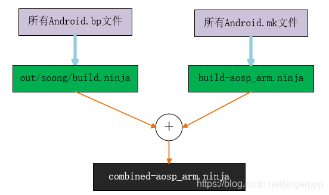

> 最开始，Ninja是用于Chromium浏览器中，Android在SDK7.0中也引入了Ninja。Ninja其实就是一个编译系统，如同make，使用Ninja主要目的就是因为其编译速度快

# 1. Ninja简介

Ninja主要是一个注重速度的小型编译系统，Ninja加入其他编译系统的海洋之中，主要目的就是更加的快速。

主要有两个有别与其他编译系统的特点：
+ Ninja的input files是由高级别的编译系统生成而来；
+ Ninja设计主要让编译尽可能的快；

Ninja包含描述任意依赖关系的最基本的功能。由于语法简单而无法表达复杂的决策。为此，Ninja用一个单独的程序来生成`input files`。该程序能分析系统的依赖关系，而且尽可能提前多做出策略，以便增加编译速度。

***

## 1.1. Makefile与Ninja区别

Makefile：
+ 默认文件名为Makefile或makefile，也常用`.make`或`.mk`作为文件后缀
+ 执行Makefile的程序，默认是GNU make，也有一些其它的实现

Ninja：
+ 默认文件名是`build.ninja`，其它文件也以`.ninja`为后缀
+ Ninja的执行程序，就是ninja命令

***

## 1.2. 代码位置

在Android项目中，make需要编译主机上安装，作为环境的一部分。 而`ninja`命令则是Android平台代码自带：

```shell
android/prebuilts$ find -name ninja
./build-tools/linux-x86/asan/bin/ninja
./build-tools/linux-x86/bin/ninja
./build-tools/darwin-x86/bin/ninja
```

***

# 2. Ninja命令

很多参数，和make是比较类似的，比如-f、-j等，不再赘述。 有趣的是-t、-d、-w这三个参数，最有用的是-t

`ninja -t clean`是清理产物，是自带的，而`make clean`往往需要自己实现。 其它都是查看编译过程信息的工具，各有作用，可以进行复杂的编译依赖分析

```shell
android/prebuilts/build-tools/linux-x86/bin$ ./ninja -h
usage: ninja [options] [targets...]

if targets are unspecified, builds the 'default' target (see manual).

options:
  --version      print ninja version ("1.9.0.git")
  -v, --verbose  show all command lines while building

  -C DIR   change to DIR before doing anything else
  -f FILE  specify input build file [default=build.ninja]输入构建.ninja文件

  -j N     run N jobs in parallel (0 means infinity) [default=14 on this system]类似make -j8
  -k N     keep going until N jobs fail (0 means infinity) [default=1]
  -l N     do not start new jobs if the load average is greater than N
  -n       dry run (don not run commands but act like they succeeded)

  -d MODE  enable debugging (use '-d list' to list modes)
  -t TOOL  run a subtool (use '-t list' to list subtools)
    terminates toplevel options; further flags are passed to the tool
  -o FLAG  adjust options (use '-o list' to list options)
  -w FLAG  adjust warnings (use '-w list' to list warnings)

  --frontend COMMAND    execute COMMAND and pass serialized build output to it
  --frontend_file FILE  write serialized build output to FILE
```

```shell
android/prebuilts/build-tools/linux-x86/bin$ ./ninja -t list
ninja subtools:
    browse  browse dependency graph in a web browser 在web浏览器中浏览依赖关系图
     clean  clean built files 清除生成的文件
  commands  list all commands required to rebuild given targets 列出重建给定目标所需的所有命令
      deps  show dependencies stored in the deps log 显示存储在deps日志中的依赖项
     graph  output graphviz dot file for targets 输出目标的graphviz点文件
    inputs  show all (recursive) inputs for a target 显示目标的所有（递归）输入
      path  find dependency path between two targets 查找依赖项两个目标之间的路径
     query  show inputs/outputs for a path 显示路径的输入/输出
   targets  list targets by their rule or depth in the DAG 在DAG中按规则或深度列出目标
    compdb  dump JSON compilation database to stdout 将JSON编译数据库转储到stdout
 recompact  recompacts ninja-internal data structures 重组ninja-internal内部数据结构
```

***

# 3. Android中的ninja

参考Android 12源码，Android编译中会生成：
+ `out/soong/build.ninja`
+ `out/build-<product_name>.ninja`
+ `out/build-<product_name>-package.ninja`

最终合成为`out/out/combined-<product_name>.ninja`

## 3.1. build-*.ninja文件

out根目录通常非常大，几十到几百MB。 对make全编译，命名是`build-<product_name>.ninja`。 如果Makefile发生修改，需要重新产生Ninja文件。

1. `ckati`将`Android.mk`编译成`out/build-<product_name>.ninja`
2. `ckati`将`Android.mk`编译成`out/build-<product_name>-package.ninja`

## 3.2. out/soong/build.ninja文件

`soong+blueprint`将`Android.bp`编译成`out/soong/build.ninja`

它是从所有的Android.bp转换过来的。

`build-*.ninja`是从所有的Makefile，用Kati转换过来的，包括`build/core/*.mk`和所有的`Android.mk`。 所以，在不使用Soong时，它是唯一入口。在使用了Soong以后，会新增源于`Android.bp`的`out/soong/build.ninja`，所以最终会需要`combined-*.ninja`来组合一下

**PS：**可以通过命令，单独产生全编译的Ninja文件：`make nothing`

***

## 3.3. combined-*.ninja 文件

运行Ninja命令（代码入口：`build/soong/ui/build/ninja.go`）， 解析上面的`.ninja`文件合成最终的`out/combined-<product_name>.ninja`

**文件内容示例如下：**

```go
builddir = out
pool local_pool
 depth = 42
build _kati_always_build_: phony
subninja out/build-<product_name>.ninja
subninja out/build-<product_name>-package.ninja
subninja out/soong/build.ninja
```

使用Soong后，`combined-*.ninja`是Ninja编译执行的真正入口！



***

# 4. Ninja编译

在产生全编译的Ninja文件后，可以绕过Makefile，单独使用ninja进行编译：

+ 全编译（7.0版本），相当于make：`ninja -f out/build-<product_name>.ninja`
+ 单独编译模块，比如Settings，相当于make Settings：`ninja -f out/build-<product_name>.ninja Settings`

在8.0以上，上面的文件应该替换为`out/combined-<product_name>.ninja`，否则可能找不到某些Target。

另外，还有办法不用输入`-f`参数。 如前所述，如同Makefile之于make，ninja默认的编译文件是`build.ninja`。 所以，使用软链接，可以避免每次输入繁琐的`-f`。

```shell
ln -s out/combined-<product_name>.ninja build.ninja
ninja Settings
```

用ninja进行单模块编译的好处，除了更快以外，还不用生成单模块的Ninja文件，省了四五分钟

***

# 5. 参考

+ [Android中Ninja简介](https://justinwei.blog.csdn.net/article/details/84770716)
+ [Ninja简介-Android10.0编译系统（九）](https://mp.weixin.qq.com/s?__biz=MjM5NDk5ODQwNA==&mid=2652469394&idx=1&sn=7a9d619da1fe969a7894e9f29dceff69&chksm=bd12e9798a65606f2ba7648aedf5baa0d1757c77a090454dc93772e0bad5cf74be808b1a25eb&scene=178&cur_album_id=1552818877418487808#rd)
